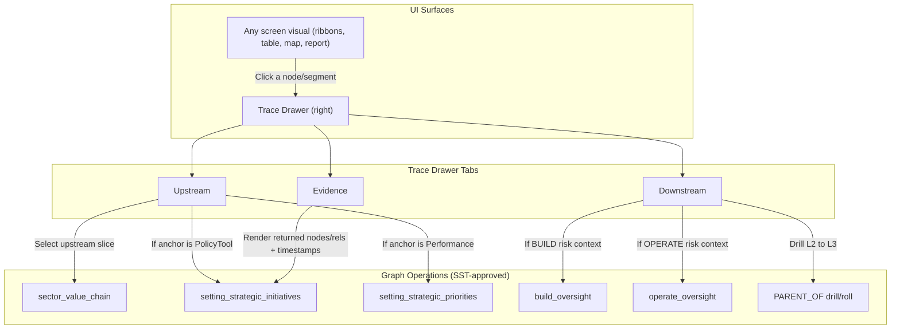

---

## 1) Per-screen mapping to exact graph queries (SST v1.1)

### Shared output contract (append to all queries)

Use the SST **Standard Return Clause** exactly as-is to return nodes + relationships for rendering/trace. 

### A) Controls Desk → Control Signals (the 4 ribbons)

#### 1) Steering Signals (Policy/Objective → Capability priorities → gaps → (optional) build portfolio)

**Primary query:** `setting_strategic_initiatives` 

* Anchor options (match UI): SectorObjective / SectorPolicyTool / EntityCapability 
* Use when the screen is answering: “Where governance intent is pushing BUILD pressure”.

**UI parameters:**

* `$year` (0 for all, else exact year) 
* `$id` = selected objective/policy/capability id 

**Optional toggle inside same screen:**

* If you want “pure steering without portfolio”: stop at p3 (cap → gaps) and skip p4–p5 (projects/adoption). (That’s a UI decision; traversal is already defined as p1..p5.) 

---

#### 2) Risk Signals (BUILD mode vs OPERATE mode)

This screen must be **two explicit queries**, depending on mode:

**BUILD mode:** `build_oversight` 

* Anchor: EntityRisk (preferred) 
* Returns: risk ↔ capability plus active INFORMS links to policy tools 

**OPERATE mode:** `operate_oversight` 

* Anchor: EntityRisk (preferred) 
* Returns: risk ↔ capability plus active INFORMS links to performance targets 

**UI parameters:** `$year`, `$id` (risk id), same pattern as SST. 

---

#### 3) Delivery Signals (Org/Process/IT load accumulating into projects/adoption)

There is no single dedicated “delivery_signals” chain in SST v1.1; the closest approved traversals are:

* **Build-side delivery feasibility:** use `setting_strategic_initiatives` (because it is the approved path that reaches projects/adoption from steering intent). 
* **Ops-side internal execution spine (process → system → vendor):** use `sustainable_operations` to show “delivery fragility / dependency bottlenecks” when the lane is process/IT/vendor-driven. 
* If you want a single lane that starts from “process” and stays internal, `sustainable_operations` is the canonical one. 

**Practical screen mapping (what your current Delivery Signals UI is trying to do):**

* Left column “Org/Proc/IT” lanes: start anchors are (EntityOrgUnit | EntityProcess | EntityITSystem) that appear as `gap` nodes from `setting_strategic_initiatives` p3. 
* Middle “IT / Org / Proc” nodes: these are still the same `gap` nodes from p3. 
* Right “Projects → Adoption”: p4–p5 from `setting_strategic_initiatives`. 
* For “vendor/system dependency”: call `sustainable_operations` when the selected node is a process (or when a gap node is a process). 

---

#### 4) Integrity Signals (leakage / broken chain)

SST defines “Integrated Oversight” as a **drill pattern**, not a single path: Chain 7. 
Your “Integrity Signals” screen is effectively Chain 7 visualized.

**Exact query mapping (composite, but still SST-approved):**

* Start at (SectorPolicyTool L2 | SectorPerformance L2) 
* Then use:

  1. `setting_strategic_initiatives` when the L2 anchor is a Policy Tool “sets priorities” context 
  2. `setting_strategic_priorities` when the L2 anchor is a Performance “sets targets” context 
  3. `build_oversight` or `operate_oversight` to bring back active INFORMS + risk roll-up 
  4. Use `PARENT_OF` traversals for L2→L3 drill and L3→L2 roll-up as described in Chain 7. 

(You don’t need new relationship types: the SST explicitly mandates PARENT_OF for level traversal.) 

---

### B) Planning Desk (3 tabs)

#### 1) Intervention Planning (tactical adjustments on a capability)

This is “build steering + execution feasibility”:

* Base graph: `setting_strategic_initiatives` (objective/policy → capability → footprint → projects/adoption) 
* Risk context (if you show risk constraints in the canvas):

  * BUILD mode: `build_oversight` 
  * OPERATE mode (if the capability is active): `operate_oversight` 

**UI rule:** Intervention Planning must always keep “source of trigger” explicit: Risk Signals / Control Signals are the sources that nominate the capability/policy tool/performance target. Chain 7 describes that drill and return loop. 

---

#### 2) Strategic Reset (annual direction setting)

This is “targets cascade into capability footprint” and should **default to the corrected canonical**:

* Base query: `setting_strategic_priorities` **with execution-trace toggle OFF** (stop at p4) 
* If the user toggles “Include execution trace”: include p5–p6 (projects/adoption)  

---

#### 3) Scenario Simulation (what-if analysis)

Graph retrieval is still one of the above planning queries; the “simulation” is not a new traversal type. So:

* If the scenario is policy-tool mix / priority changes: use `setting_strategic_initiatives` 
* If the scenario is KPI target changes: use `setting_strategic_priorities` (canonical) 

Then compute “diff view” from the same node sets (current vs scenario) using properties; no new relationships required.

---

### C) Reporting Desk (2 modes)

#### 1) Standard Reports (PMO-style: performance / risk / portfolio / ministerial)

This is “predefined report templates fed by the same traversals”:

* **Performance report (targets & outcomes):** `setting_strategic_priorities` (canonical) 
* **Risk report:** `operate_oversight` and/or `build_oversight` depending on mode 
* **Portfolio / Build report:** `setting_strategic_initiatives` (includes projects/adoption) 
* **Ministerial brief (external execution narrative):** `sector_value_chain` 

#### 2) Control Outcomes (projection + before/after)

This must be sourced from the same control loops, then rendered as “decision timeline”:

* “What decision was taken” is a UI concept; the graph evidence is:

  * The policy tool / performance target node being acted on (L2)
  * The capability + footprint (L3 drill)
  * The risk/performance movement via active INFORMS (build/operate oversight)

So the exact queries are the Chain 7 composite again:

* Start at the selected Policy Tool or Performance target (L2) 
* Retrieve drill via `setting_*` query, then risk roll-up via `*_oversight`, using PARENT_OF drill/roll. 

---

### D) Sector Desk (your “Sector Ops attempt”)

Your map + strategic impact cards should be explicitly backed by:

* External influence loop: `sector_value_chain`  
* Targets cascade into capabilities (to connect “sector KPIs” to “capabilities”): `setting_strategic_priorities` (canonical) 
* If you show operational threat to KPIs: `operate_oversight` 

That gives you a clean “Sector view → Capability consequences” without inventing new relations.

---

## 2) Trace interaction pattern (visual + event→query contract)

### A) One universal Trace pattern (works on every screen)

**Core concept:** “Trace is not a screen.” It is a **right-side drawer** that can be invoked from any node/segment, and it always returns three stacked layers:

1. **Chain slice (what path am I seeing?)**
2. **Level drill (L2 ↔ L3 via PARENT_OF)** 
3. **Evidence & audit (which sources, last-updated, missing inputs)** (audit is UI; evidence is the returned node/rel set + timestamps/properties)

### B) Visual pattern (Mermaid, aligned to your standard)

### C) Exact interaction-to-query mapping (no ambiguity)

#### Event 1 — Click on any visual element (ribbon segment / table row / map marker / report KPI)

**Payload:**

* `selectedNodeId` (elementId or domain id)
* `selectedNodeLabel` (labels(n))
* `year`
* `contextMode` ∈ {BUILD, OPERATE} (only if the calling screen is risk-related)

**Immediate call:** the screen’s own base chain query (Section 1) with `$id=selectedNodeId`.

#### Event 2 — Open Trace Drawer → “Upstream” tab

Decision rule:

* If selected node is SectorObjective or SectorPolicyTool or any stakeholder/transaction/performance: call `sector_value_chain` anchored appropriately (objective preferred).  
* If selected node is EntityCapability and the question is “why prioritized”: call `setting_strategic_initiatives`. 
* If selected node is EntityCapability and the question is “why targeted”: call `setting_strategic_priorities` (canonical). 

#### Event 3 — Trace Drawer → “Downstream” tab

Decision rule:

* If contextMode=BUILD or capability status is planned/in-progress: call `build_oversight`. 
* If contextMode=OPERATE or capability is active: call `operate_oversight`. 
* If user clicks “Drill to level L3 footprint”: use PARENT_OF roll per Chain 7. 

#### Event 4 — “Include execution trace (Projects/Adoption)” toggle

* For “Strategic Priorities”: append optional p5–p6 and render as separate “Execution Trace” subpanel, not mixed into canonical.  
* For “Steering/Initiatives”: it’s already included by default (p4–p5); toggle can hide it. 

---

## 3) Minimal “per screen → trace anchors” (what the UI should allow users to click)

* **Steering Signals:** clickable anchors = SectorObjective, SectorPolicyTool, EntityCapability, any gap node. 
* **Risk Signals:** clickable anchors = EntityRisk (primary), EntityCapability, SectorPolicyTool (BUILD) / SectorPerformance (OPERATE).  
* **Integrity Signals:** clickable anchors = SectorPolicyTool L2, SectorPerformance L2, EntityCapability (L2/L3), EntityRisk (L3). 
* **Planning (Intervention):** clickable anchors = nominated EntityCapability + its footprint (org/process/IT) + risk node.  
* **Reporting:** clickable anchors = report KPI rows that map to SectorPerformance / SectorObjective / EntityCapability, plus drill links to oversight.  
