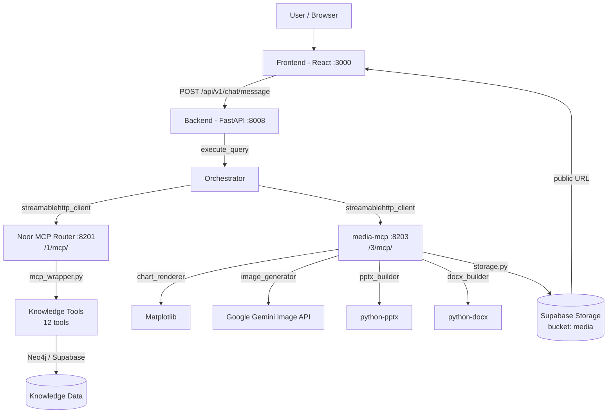
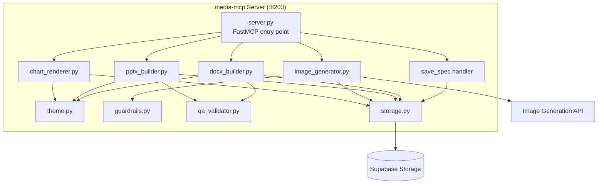
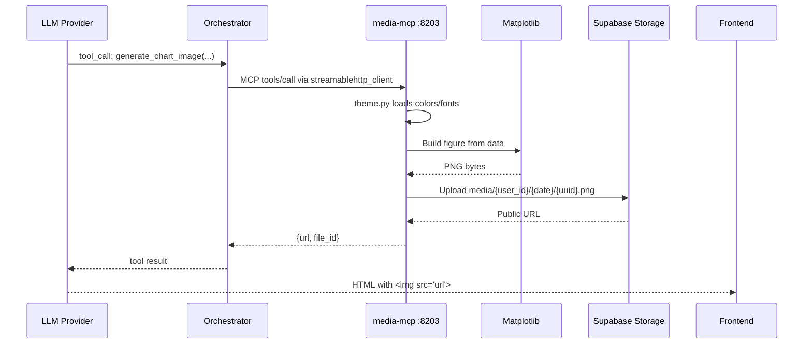
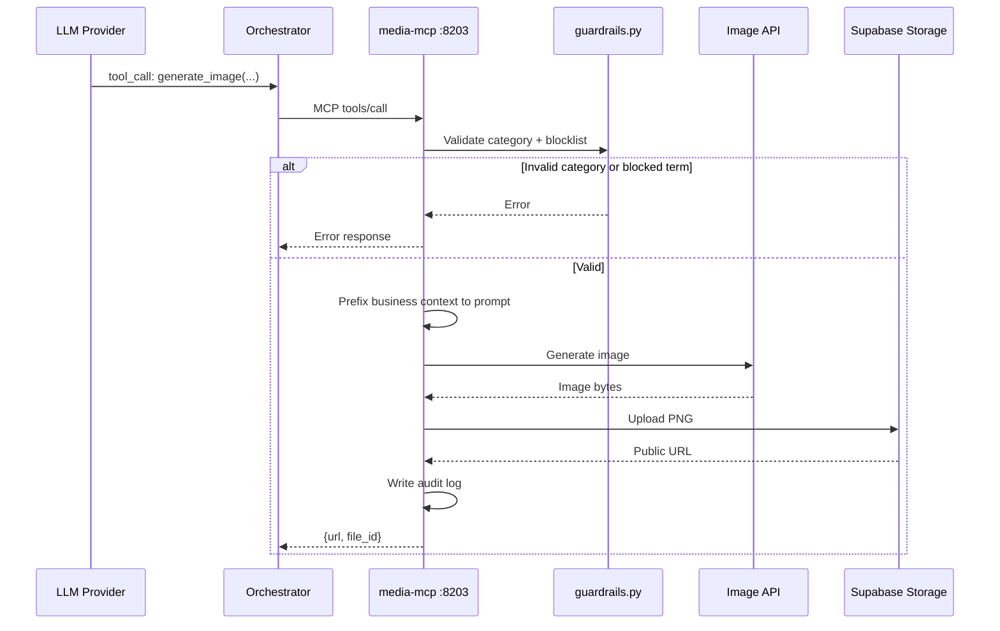
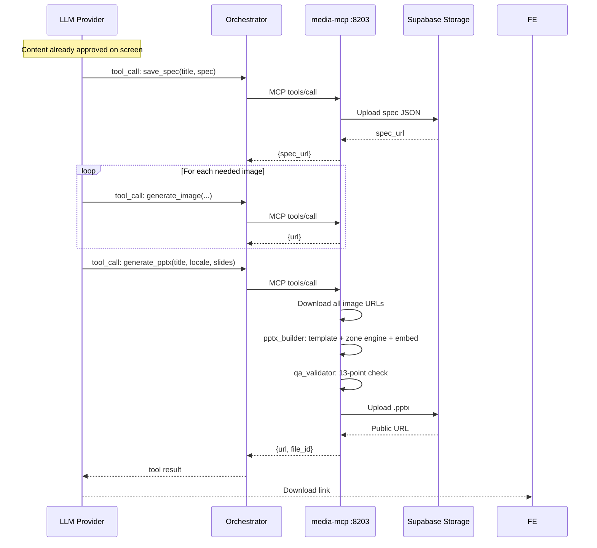
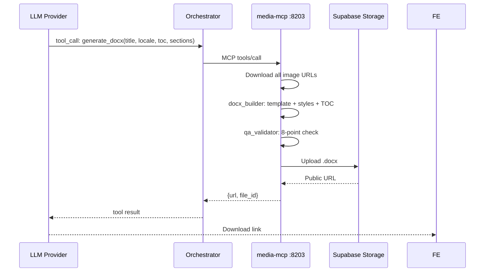

# Technical Design Document: media-mcp

**Author:** Mosab / Claude
**Status:** Draft
**Created:** 2026-03-16
**Version:** 3.0
**Related BRD:** [01-BRD-media-mcp-v3.md](./01-BRD-media-mcp-v3.md)

---

## 1. System Architecture

### 1.1 Context Diagram



### 1.2 media-mcp Component Diagram



### 1.3 Data Flow: Chart Image Generation (end-to-end)



### 1.4 Data Flow: Image Generation (end-to-end)



### 1.5 Data Flow: PPTX Generation (end-to-end)



### 1.6 Data Flow: DOCX Generation (end-to-end)



---

## 2. MCP Server Implementation

### 2.1 Server Setup (Following Existing Pattern)

The media-mcp server follows the pattern established by the Noor MCP Router in `/home/mastersite/development/josoorbe/backend/mcp-server/servers/mcp-router/src/mcp_router/server.py`.

**Server location:** `/home/mastersite/development/josoorbe/backend/mcp-server/servers/media-mcp/`

**Directory structure:**
```
backend/mcp-server/servers/media-mcp/
+-- media_router_config.yaml
+-- templates/
|   +-- josoor.pptx
|   +-- josoor_report.docx
|   +-- josoor_memo.docx
|   +-- josoor_brief.docx
|   +-- josoor_policy.docx
+-- theme.json
+-- src/
|   +-- media_mcp/
|       +-- __init__.py
|       +-- server.py              # FastMCP entry, tool registration
|       +-- chart_renderer.py      # Matplotlib chart pipeline
|       +-- image_generator.py     # Image API client
|       +-- pptx_builder.py        # PowerPoint assembly
|       +-- docx_builder.py        # Word document assembly
|       +-- storage.py             # Supabase Storage upload
|       +-- guardrails.py          # Category/blocklist validation
|       +-- qa_validator.py        # PPTX/DOCX QA checks
|       +-- theme.py               # theme.json loader
+-- __main__.py                    # Entry point
```

### 2.2 media_router_config.yaml

```yaml
tools:
  - name: generate_chart_image
    description: "Render a data chart as a PNG image. Returns a Supabase Storage URL. Use this INSTEAD of <ui-chart> tags. The LLM embeds the returned URL as  in HTML."
    parameters:
      chart_type: "Chart type: bar, column, line, area, pie, donut, radar, scatter, combo, waterfall, treemap. Required."
      title: "Chart title string. Required."
      data: "JSON object with categories (array of strings) and series (array of {name, data, color?}). Required."
      options: "JSON object with optional keys: subtitle, legend (bool), axis_labels ({x, y}), stacked (bool), locale ('en'|'ar'). Optional."
      width: "Image width in pixels. Default 800. Optional."
      height: "Image height in pixels. Default 500. Optional."

  - name: generate_image
    description: "Generate a business visual (diagram, infographic, icon, etc.) via image API. Restricted to business categories only. Returns a Supabase Storage URL."
    parameters:
      category: "Business category. Required. One of: icon, icon_set, conceptual_diagram, infographic, org_structure, process_flow, comparison, timeline, matrix, framework, architecture, roadmap, value_chain, cover."
      description: "What the image should depict. Required."
      style: "Visual style: corporate, flat, isometric. Default: corporate. Optional."
      locale: "Language: en or ar. Default: en. Optional."
      width: "Image width in pixels. Default 1024. Optional."
      height: "Image height in pixels. Default 768. Optional."

  - name: generate_pptx
    description: "Assemble a PowerPoint presentation from a structured slide spec. Content must already be validated on screen. Returns a Supabase Storage URL to the .pptx file."
    parameters:
      title: "Presentation title. Required."
      locale: "Language: en or ar. Required."
      spec_url: "Optional Supabase URL to a previously saved spec JSON (from save_spec). If provided, slides array is loaded from this URL."
      slides: "JSON array of slide objects. Each has: layout, title, elements (array), speaker_notes. Required if spec_url is not provided."

  - name: generate_docx
    description: "Assemble a Word document from structured content. Returns a Supabase Storage URL to the .docx file."
    parameters:
      title: "Document title. Required."
      locale: "Language: en or ar. Required."
      toc: "Generate table of contents. Default: true. Optional."
      sections: "JSON array of section objects. Each has: heading, level (1-3), content (array of element objects). Required."

  - name: save_spec
    description: "Save a PPTX slide spec as JSON to Supabase Storage. Returns a URL that can be passed to generate_pptx via spec_url. Use this to persist the approved slide structure."
    parameters:
      title: "Spec title (for filename). Required."
      spec: "JSON object containing the full slide structure. Required."

server:
  host: 127.0.0.1
  port: 8203
  transport: http
```

### 2.3 Tool Registration Pattern

The server.py follows the existing FastMCP pattern. Unlike the Noor Router which uses dynamic registration for chain tools, media-mcp registers each tool explicitly with typed signatures (same pattern as `_recall_memory_impl`, `_read_uploaded_file_impl`, etc. in the existing server.py).

```python
# Pattern from existing server.py -- each tool is a function registered via mcp.tool()
from fastmcp.server import FastMCP

mcp = FastMCP('media-mcp', stateless_http=True)

@mcp.tool(name="generate_chart_image", description="...")
async def generate_chart_image(
    chart_type: str,
    title: str,
    data: dict,
    options: dict = None,
    width: int = 800,
    height: int = 500,
) -> str:
    # Implementation calls chart_renderer.render()
    ...
```

Each of the 5 tools (`generate_chart_image`, `generate_image`, `generate_pptx`, `generate_docx`, `save_spec`) is defined as an explicit async function with typed parameters and registered via the `@mcp.tool()` decorator.

### 2.4 Server Startup

```python
# __main__.py
def run_http():
    host = os.environ.get('MEDIA_MCP_HOST', '127.0.0.1')
    port = int(os.environ.get('MEDIA_MCP_PORT', '8203'))
    mcp = create_media_server()
    import asyncio
    loop = asyncio.get_event_loop()
    loop.create_task(mcp.run_http_async(host=host, port=port, path='/mcp/', middleware=[]))
    loop.run_forever()
```

Matches the existing pattern in `server.py:381-398` (`run_http` function).

---

## 3. Tool Technical Specifications

### 3.1 generate_chart_image

**Module:** `chart_renderer.py`

#### Input JSON Schema

```json
{
  "type": "object",
  "properties": {
    "chart_type": {
      "type": "string",
      "enum": ["bar", "column", "line", "area", "pie", "donut", "radar", "scatter", "combo", "waterfall", "treemap"],
      "description": "Type of chart to render"
    },
    "title": {
      "type": "string",
      "minLength": 1,
      "maxLength": 200,
      "description": "Chart title"
    },
    "data": {
      "type": "object",
      "properties": {
        "categories": {
          "type": "array",
          "items": { "type": "string" },
          "minItems": 1,
          "maxItems": 100
        },
        "series": {
          "type": "array",
          "items": {
            "type": "object",
            "properties": {
              "name": { "type": "string" },
              "data": {
                "type": "array",
                "items": { "type": "number" }
              },
              "color": { "type": "string", "pattern": "^#[0-9a-fA-F]{6}$" }
            },
            "required": ["name", "data"]
          },
          "minItems": 1,
          "maxItems": 20
        }
      },
      "required": ["categories", "series"]
    },
    "options": {
      "type": "object",
      "properties": {
        "subtitle": { "type": "string", "maxLength": 200 },
        "legend": { "type": "boolean", "default": true },
        "axis_labels": {
          "type": "object",
          "properties": {
            "x": { "type": "string" },
            "y": { "type": "string" }
          }
        },
        "stacked": { "type": "boolean", "default": false },
        "locale": {
          "type": "string",
          "enum": ["en", "ar"],
          "default": "en"
        }
      },
      "default": {}
    },
    "width": {
      "type": "integer",
      "minimum": 200,
      "maximum": 2000,
      "default": 800
    },
    "height": {
      "type": "integer",
      "minimum": 150,
      "maximum": 1500,
      "default": 500
    }
  },
  "required": ["chart_type", "title", "data"]
}
```

#### Output JSON Schema

```json
{
  "type": "object",
  "properties": {
    "url": {
      "type": "string",
      "format": "uri",
      "description": "Public Supabase Storage URL to the rendered chart PNG"
    },
    "file_id": {
      "type": "string",
      "format": "uuid",
      "description": "Unique identifier for the generated file"
    }
  },
  "required": ["url", "file_id"]
}
```

#### Error Response Format (Consistent Across All Tools)

```json
{
  "error": true,
  "code": "CHART_RENDER_FAILED",
  "message": "Human-readable error description",
  "details": {}
}
```

Error codes for this tool:
- `INVALID_CHART_TYPE` -- chart_type not in enum
- `INVALID_DATA` -- data missing categories or series, or empty
- `CHART_RENDER_FAILED` -- Matplotlib rendering error
- `UPLOAD_FAILED` -- Supabase Storage upload error
- `TIMEOUT` -- Render exceeded 3 seconds

#### Implementation Notes

- **Library:** Matplotlib with Agg backend (headless server-safe)
- **Pipeline:** Parse data -> Build figure -> Apply theme colors/fonts -> Set RTL if Arabic -> Render to PNG bytes in BytesIO -> Upload to Supabase -> Return URL
- **RTL:** For `locale: "ar"`, axis labels and title use `matplotlib.rcParams` with Arabic font family, right-to-left axis direction
- **Theme:** Colors loaded from `theme.json` via `theme.py` -- chart palette, title font, background color
- **DPI:** 150 (balances quality vs file size for web display)

---

### 3.2 generate_image

**Module:** `image_generator.py`

#### Input JSON Schema

```json
{
  "type": "object",
  "properties": {
    "category": {
      "type": "string",
      "enum": [
        "icon", "icon_set", "conceptual_diagram", "infographic",
        "org_structure", "process_flow", "comparison", "timeline",
        "matrix", "framework", "architecture", "roadmap",
        "value_chain", "cover"
      ],
      "description": "Business visual category"
    },
    "description": {
      "type": "string",
      "minLength": 10,
      "maxLength": 1000,
      "description": "What the image should depict"
    },
    "style": {
      "type": "string",
      "enum": ["corporate", "flat", "isometric"],
      "default": "corporate"
    },
    "locale": {
      "type": "string",
      "enum": ["en", "ar"],
      "default": "en"
    },
    "width": {
      "type": "integer",
      "minimum": 256,
      "maximum": 2048,
      "default": 1024
    },
    "height": {
      "type": "integer",
      "minimum": 256,
      "maximum": 2048,
      "default": 768
    }
  },
  "required": ["category", "description"]
}
```

#### Output JSON Schema

```json
{
  "type": "object",
  "properties": {
    "url": {
      "type": "string",
      "format": "uri"
    },
    "file_id": {
      "type": "string",
      "format": "uuid"
    }
  },
  "required": ["url", "file_id"]
}
```

#### Error Codes

- `INVALID_CATEGORY` -- category not in allowed enum
- `INVALID_DATA` -- Input data fails validation (e.g., description too short)
- `BLOCKED_CONTENT` -- description contains blocked terms
- `IMAGE_API_ERROR` -- upstream image API failure
- `UPLOAD_FAILED` -- Supabase Storage error
- `TIMEOUT` -- generation exceeded 30 seconds

#### Implementation Notes

- **Library:** `google-genai` (Google Gemini Image Generation API)
- **Pipeline:** Validate category -> Check blocklist -> Build prompt with business prefix -> Call API -> Save bytes -> Upload to Supabase -> Write audit log -> Return URL
- **Business prefix** (prepended to every prompt): `"Professional business diagram for a government strategy platform. Clean, minimal corporate style. No people, no photographs, no text overlays."`
- **Audit log:** Every request is logged to the Supabase table `media_audit_log`. Schema: `CREATE TABLE media_audit_log (id UUID DEFAULT gen_random_uuid() PRIMARY KEY, user_id TEXT NOT NULL, tool_name TEXT NOT NULL, category TEXT, description TEXT, result_url TEXT, error TEXT, duration_ms INTEGER, created_at TIMESTAMPTZ DEFAULT now());`
- **API key:** Read from environment variable `GEMINI_IMAGE_API_KEY`

---

### 3.3 generate_pptx

**Module:** `pptx_builder.py`

#### Input JSON Schema

```json
{
  "type": "object",
  "properties": {
    "title": {
      "type": "string",
      "minLength": 1,
      "maxLength": 300
    },
    "locale": {
      "type": "string",
      "enum": ["en", "ar"]
    },
    "spec_url": {
      "type": "string",
      "format": "uri",
      "description": "Optional Supabase URL to a saved spec JSON"
    },
    "slides": {
      "type": "array",
      "items": {
        "type": "object",
        "properties": {
          "layout": {
            "type": "string",
            "enum": [
              "title", "section_divider", "content_visual", "content_text",
              "comparison", "data_highlight", "closing", "chart_left",
              "chart_full", "chart_text", "table_full", "visual_text",
              "visual_full", "two_column", "bullets_icon", "process_flow",
              "timeline", "matrix", "key_message"
            ]
          },
          "title": {
            "type": "string",
            "maxLength": 200
          },
          "elements": {
            "type": "array",
            "items": {
              "type": "object",
              "properties": {
                "type": {
                  "type": "string",
                  "enum": [
                    "heading", "bullets", "image", "table",
                    "chart_image", "callout", "arrow_flow",
                    "separator", "footnote"
                  ]
                },
                "position": {
                  "type": "string",
                  "enum": [
                    "top_left", "top_center", "top_right",
                    "left_half", "center", "right_half",
                    "bottom_left", "bottom_center", "bottom_right",
                    "full_width", "full_slide",
                    "left_third", "center_third", "right_third"
                  ]
                },
                "text": { "type": "string" },
                "items": {
                  "type": "array",
                  "items": { "type": "string" },
                  "maxItems": 5
                },
                "url": { "type": "string", "format": "uri" },
                "caption": { "type": "string" },
                "headers": {
                  "type": "array",
                  "items": { "type": "string" },
                  "maxItems": 5
                },
                "rows": {
                  "type": "array",
                  "items": {
                    "type": "array",
                    "items": { "type": "string" }
                  },
                  "maxItems": 6
                },
                "highlight": { "type": "string" },
                "steps": {
                  "type": "array",
                  "items": { "type": "string" },
                  "minItems": 3,
                  "maxItems": 5
                }
              },
              "required": ["type", "position"]
            }
          },
          "speaker_notes": { "type": "string" }
        },
        "required": ["layout", "title", "elements"]
      },
      "minItems": 1,
      "maxItems": 20
    }
  },
  "required": ["title", "locale"],
  "oneOf_constraint": "At least one of 'spec_url' or 'slides' must be provided. If both are present, 'slides' takes precedence."
}
```

#### Output JSON Schema

```json
{
  "type": "object",
  "properties": {
    "url": {
      "type": "string",
      "format": "uri"
    },
    "file_id": {
      "type": "string",
      "format": "uuid"
    }
  },
  "required": ["url", "file_id"]
}
```

#### Error Codes

- `INVALID_LAYOUT` -- layout not in enum
- `SPEC_FETCH_FAILED` -- could not download spec from spec_url
- `QA_VALIDATION_FAILED` -- one or more QA checks failed (details in `details` field listing each failed check)
- `IMAGE_DOWNLOAD_FAILED` -- could not download an image URL for embedding
- `PPTX_BUILD_FAILED` -- python-pptx assembly error
- `UPLOAD_FAILED` -- Supabase Storage error
- `TIMEOUT` -- assembly exceeded 60 seconds
- `SLIDE_LIMIT_EXCEEDED` -- more than 20 slides

#### Implementation Notes

- **Library:** `python-pptx`
- **Input validation:** At least one of `spec_url` or `slides` must be provided. If neither is present, the tool returns `INVALID_LAYOUT` error before processing. If both are provided, `slides` takes precedence and `spec_url` is ignored.
- **Pipeline:** Load template -> If spec_url, fetch and parse JSON -> For each slide: select layout -> zone engine maps positions to EMU coordinates -> add elements (text, images, tables) -> embed images as binary -> apply theme -> run QA validator -> save to BytesIO -> upload to Supabase -> return URL
- **Image embedding:** All image URLs are downloaded via `httpx` and embedded as binary blobs in the PPTX. No external URL references remain in the file.
- **RTL:** For `locale: "ar"`, text runs use `pptx.util.Pt` with Arabic font, paragraphs set `alignment = PP_ALIGN.RIGHT`, and slide text direction is set to RTL.

---

### 3.4 generate_docx

**Module:** `docx_builder.py`

#### Input JSON Schema

```json
{
  "type": "object",
  "properties": {
    "title": {
      "type": "string",
      "minLength": 1,
      "maxLength": 300
    },
    "locale": {
      "type": "string",
      "enum": ["en", "ar"]
    },
    "toc": {
      "type": "boolean",
      "default": true
    },
    "sections": {
      "type": "array",
      "items": {
        "type": "object",
        "properties": {
          "heading": {
            "type": "string",
            "maxLength": 200
          },
          "level": {
            "type": "integer",
            "enum": [1, 2, 3]
          },
          "content": {
            "type": "array",
            "items": {
              "type": "object",
              "properties": {
                "type": {
                  "type": "string",
                  "enum": [
                    "paragraph", "bullets", "table", "image",
                    "chart_image", "callout", "page_break"
                  ]
                },
                "text": { "type": "string" },
                "items": {
                  "type": "array",
                  "items": { "type": "string" }
                },
                "headers": {
                  "type": "array",
                  "items": { "type": "string" }
                },
                "rows": {
                  "type": "array",
                  "items": {
                    "type": "array",
                    "items": { "type": "string" }
                  }
                },
                "url": { "type": "string", "format": "uri" },
                "caption": { "type": "string" }
              },
              "required": ["type"]
            }
          }
        },
        "required": ["heading", "level", "content"]
      },
      "minItems": 1
    }
  },
  "required": ["title", "locale", "sections"]
}
```

#### Output JSON Schema

```json
{
  "type": "object",
  "properties": {
    "url": {
      "type": "string",
      "format": "uri"
    },
    "file_id": {
      "type": "string",
      "format": "uuid"
    }
  },
  "required": ["url", "file_id"]
}
```

#### Error Codes

- `QA_VALIDATION_FAILED` -- one or more QA checks failed
- `IMAGE_DOWNLOAD_FAILED` -- could not download an image URL
- `DOCX_BUILD_FAILED` -- python-docx assembly error
- `UPLOAD_FAILED` -- Supabase Storage error
- `TIMEOUT` -- assembly exceeded 30 seconds
- `INVALID_HEADING_LEVEL` -- heading level not 1, 2, or 3

#### Implementation Notes

- **Library:** `python-docx`
- **Template selection:** The tool supports four document templates (report, memo, brief, policy) via internal `doc_type` routing in `docx_builder.py`. For v1, only 'report' is used — the LLM does not select the template. Future versions may expose `doc_type` as a tool parameter.
- **Pipeline:** Load template -> Build cover page (title, date, classification) -> Generate TOC placeholder -> For each section: add heading with style -> for each content element: add paragraph/bullets/table/image -> embed images as binary -> apply theme styles -> run QA validator -> save to BytesIO -> upload to Supabase -> return URL
- **TOC:** Uses Word's built-in TOC field code (`\o "1-3"` for heading levels 1-3). The TOC auto-updates when opened in Word.
- **RTL:** For `locale: "ar"`, section properties set `bidi` flag, paragraph alignment is RIGHT, font family is Noto Sans Arabic or Cairo.

---

### 3.5 save_spec

**Module:** Handled directly in `server.py` (simple utility -- no separate module needed)

#### Input JSON Schema

```json
{
  "type": "object",
  "properties": {
    "title": {
      "type": "string",
      "minLength": 1,
      "maxLength": 200
    },
    "spec": {
      "type": "object",
      "description": "The full slide structure as a JSON object"
    }
  },
  "required": ["title", "spec"]
}
```

#### Output JSON Schema

```json
{
  "type": "object",
  "properties": {
    "spec_url": {
      "type": "string",
      "format": "uri",
      "description": "Supabase Storage URL to the saved spec JSON"
    }
  },
  "required": ["spec_url"]
}
```

#### Error Codes

- `INVALID_SPEC` -- spec is not valid JSON or is empty
- `UPLOAD_FAILED` -- Supabase Storage error

#### Implementation Notes

- Serializes the `spec` dict to JSON bytes
- Uploads to `media/{user_id}/{date}/spec_{uuid}.json`
- Returns the public URL
- No validation of spec content structure (that happens in `generate_pptx` when the spec is consumed)

---

## 4. Module Designs

### 4.1 chart_renderer.py

**Purpose:** Render data charts as PNG images using Matplotlib.

**Key functions:**

```python
async def render_chart(
    chart_type: str,
    title: str,
    data: dict,
    options: dict,
    width: int,
    height: int,
    theme: ThemeConfig,
) -> bytes:
    """
    Renders a chart and returns PNG bytes.

    Pipeline:
    1. Validate chart_type against allowed enum
    2. Create figure with figsize=(width/100, height/100), dpi=150
    3. Select rendering function by chart_type:
       - bar/column: ax.bar() / ax.barh()
       - line: ax.plot()
       - area: ax.fill_between()
       - pie/donut: ax.pie() with optional inner circle
       - radar: PolarAxes
       - scatter: ax.scatter()
       - combo: overlay bar + line
       - waterfall: custom stacked bar with connectors
       - treemap: squarify library
    4. Apply theme: colors from theme.colors.chart_palette,
       fonts from theme.fonts (Arabic: Noto Sans Arabic)
    5. Set RTL if locale == "ar":
       - Reverse category axis order
       - Set Arabic font via rcParams
       - Title and labels use Arabic text direction
    6. Add legend if options.legend != false and series > 1
    7. Set axis labels from options.axis_labels
    8. Render to BytesIO as PNG
    9. Return bytes
    """
```

**Chart type dispatch map:**

| chart_type | Matplotlib method | Notes |
|---|---|---|
| `bar` | `ax.barh()` | Horizontal bars |
| `column` | `ax.bar()` | Vertical bars |
| `line` | `ax.plot()` | With markers |
| `area` | `ax.fill_between()` | Semi-transparent fill |
| `pie` | `ax.pie()` | Standard pie |
| `donut` | `ax.pie()` + white circle center | Inner radius 0.5 |
| `radar` | `PolarAxes` | Spider/radar chart |
| `scatter` | `ax.scatter()` | Dot plot |
| `combo` | `ax.bar()` + `ax.plot()` on twinx | First series bar, rest line |
| `waterfall` | Custom stacked bar | Positive green, negative red, connector lines |
| `treemap` | `squarify.plot()` | Proportional rectangles |

**RTL text handling:**
- Import `arabic_reshaper` and `bidi.algorithm` for proper Arabic glyph shaping
- Apply reshaping to all text strings before rendering
- Reverse axis category order for right-to-left reading

**Theme application:**
- Background color from `theme.colors.background`
- Title font: `theme.fonts.heading`, size from typography hierarchy
- Data colors: `theme.colors.chart_palette` (6 colors, cycled)
- Grid: light gray, dashed, 0.3 alpha
- Spines: removed except bottom and left

---

### 4.2 image_generator.py

**Purpose:** Generate business visuals via the Google Gemini Image API.

**Key functions:**

```python
BUSINESS_PREFIX = (
    "Professional business diagram for a government strategy platform. "
    "Clean, minimal corporate style. No people, no photographs, no text overlays."
)

async def generate_image(
    category: str,
    description: str,
    style: str,
    locale: str,
    width: int,
    height: int,
) -> bytes:
    """
    Generate a business visual and return image bytes.

    Pipeline:
    1. guardrails.validate_category(category) -- raises if invalid
    2. guardrails.check_blocklist(description) -- raises if blocked terms found
    3. Build full prompt:
       f"{BUSINESS_PREFIX} Category: {category}. Style: {style}. {description}"
    4. If locale == "ar", append: "Include Arabic text where appropriate."
    5. Call google.genai image generation:
       client = genai.Client(api_key=os.environ['GEMINI_IMAGE_API_KEY'])
       response = client.models.generate_images(
           model='imagen-3.0-generate-002',
           prompt=full_prompt,
           config=types.GenerateImagesConfig(
               number_of_images=1,
               aspect_ratio=_calc_aspect_ratio(width, height),
           )
       )
    6. Extract image bytes from response
    7. Resize if needed using Pillow
    8. Return bytes
    """

async def log_audit(
    user_id: str,
    tool_name: str,
    category: str,
    description: str,
    result_url: str,
) -> None:
    """Log media tool usage to audit trail. Called by ALL 5 tools (generate_chart_image, generate_image, generate_pptx, generate_docx, save_spec), not just generate_image."""
```

**Audit log format (written to `media_audit_log` Supabase table):**

```json
{
  "timestamp": "2026-03-16T14:30:00Z",
  "user_id": "user_123",
  "category": "process_flow",
  "description": "Approval workflow for water permits",
  "result_url": "https://....supabase.../media/img_xxx.png",
  "style": "corporate",
  "locale": "en"
}
```

---

### 4.3 pptx_builder.py

**Purpose:** Assemble PowerPoint files from structured slide specs using python-pptx.

**Key components:**

#### Template Loading

```python
def load_template(locale: str) -> Presentation:
    """
    Load the branded Josoor PPTX template.
    Template path: templates/josoor.pptx
    Template contains:
    - Master slide with Josoor branding
    - Predefined slide layouts (blank layout used; zones are positioned programmatically)
    - Embedded fonts (Noto Sans Arabic, Inter)
    - Logo placeholder
    """
```

#### Zone Engine (Position Grid to EMU Coordinates)

The zone engine converts the position grid names from the BRD (Section 6.2) to absolute EMU (English Metric Units) coordinates for python-pptx placement.

**Slide dimensions:** 13,716,000 x 9,144,000 EMU (10" x 7.5" standard 16:9)

**Margin:** 100px = approx 914,400 EMU (1 inch)

```python
# Position grid mapping (name -> (left, top, width, height) in EMU)
SLIDE_W = 13_716_000  # 10 inches
SLIDE_H = 9_144_000   # 7.5 inches
MARGIN = 914_400       # 1 inch margin

POSITION_GRID = {
    "top_left":       (MARGIN, 0,            SLIDE_W//2 - MARGIN, int(SLIDE_H * 0.4)),
    "top_center":     (SLIDE_W//4, 0,        SLIDE_W//2,          int(SLIDE_H * 0.4)),
    "top_right":      (SLIDE_W//2, 0,        SLIDE_W//2 - MARGIN, int(SLIDE_H * 0.4)),
    "left_half":      (MARGIN, int(SLIDE_H*0.10), SLIDE_W//2 - MARGIN, int(SLIDE_H*0.80)),
    "center":         (int(SLIDE_W*0.15), int(SLIDE_H*0.15), int(SLIDE_W*0.70), int(SLIDE_H*0.70)),
    "right_half":     (SLIDE_W//2, int(SLIDE_H*0.10), SLIDE_W//2 - MARGIN, int(SLIDE_H*0.80)),
    "bottom_left":    (MARGIN, int(SLIDE_H*0.60), SLIDE_W//2 - MARGIN, int(SLIDE_H*0.40)),
    "bottom_center":  (SLIDE_W//4, int(SLIDE_H*0.60), SLIDE_W//2, int(SLIDE_H*0.40)),
    "bottom_right":   (SLIDE_W//2, int(SLIDE_H*0.60), SLIDE_W//2 - MARGIN, int(SLIDE_H*0.40)),
    "full_width":     (MARGIN, int(SLIDE_H*0.10), SLIDE_W - 2*MARGIN, int(SLIDE_H*0.80)),
    "full_slide":     (0, 0, SLIDE_W, SLIDE_H),
    "left_third":     (MARGIN, int(SLIDE_H*0.10), SLIDE_W//3 - MARGIN, int(SLIDE_H*0.80)),
    "center_third":   (SLIDE_W//3, int(SLIDE_H*0.10), SLIDE_W//3, int(SLIDE_H*0.80)),
    "right_third":    (int(SLIDE_W*0.66), int(SLIDE_H*0.10), SLIDE_W//3 - MARGIN, int(SLIDE_H*0.80)),
}
```

#### Layout Router

Maps each layout type to a set of expected element placements:

```python
LAYOUT_DEFAULTS = {
    "title":           {"zones": ["center"], "visual_weight": 0.9},
    "section_divider": {"zones": ["center"], "visual_weight": 0.95},
    "content_visual":  {"zones": ["left_half", "right_half"], "visual_weight": 0.6},
    "content_text":    {"zones": ["full_width"], "visual_weight": 0.0},
    "comparison":      {"zones": ["left_half", "right_half"], "visual_weight": 0.5},
    "data_highlight":  {"zones": ["center", "bottom_center"], "visual_weight": 0.8},
    "closing":         {"zones": ["center"], "visual_weight": 0.3},
    "chart_left":      {"zones": ["left_half", "right_half"], "visual_weight": 0.6},
    "chart_full":      {"zones": ["full_width", "bottom_center"], "visual_weight": 0.8},
    "chart_text":      {"zones": ["left_half", "right_half"], "visual_weight": 0.5},
    "table_full":      {"zones": ["full_width", "bottom_center"], "visual_weight": 0.8},
    "visual_text":     {"zones": ["left_half", "right_half"], "visual_weight": 0.6},
    "visual_full":     {"zones": ["full_width", "bottom_center"], "visual_weight": 0.9},
    "two_column":      {"zones": ["left_half", "right_half"], "visual_weight": 0.0},
    "bullets_icon":    {"zones": ["full_width"], "visual_weight": 0.3},
    "process_flow":    {"zones": ["full_width"], "visual_weight": 0.7},
    "timeline":        {"zones": ["full_width"], "visual_weight": 0.7},
    "matrix":          {"zones": ["center"], "visual_weight": 0.7},
    "key_message":     {"zones": ["center"], "visual_weight": 0.9},
}
```

#### Image Embedding

```python
async def download_and_embed_image(
    slide, position: str, url: str, caption: str = None
) -> None:
    """
    Download image from URL via httpx, embed as binary in slide.

    1. httpx.get(url, timeout=10)
    2. Validate content-type is image/*
    3. Get zone coordinates from POSITION_GRID[position]
    4. slide.shapes.add_picture(BytesIO(bytes), left, top, width, height)
    5. If caption, add text box below image
    """
```

#### RTL Support

```python
def apply_rtl(paragraph, font_name: str = "Noto Sans Arabic"):
    """
    Set RTL text direction on a python-pptx paragraph.
    - paragraph.alignment = PP_ALIGN.RIGHT
    - Set bidi attribute via XML manipulation:
      pPr = paragraph._p.get_or_add_pPr()
      pPr.set(qn('a:rtl'), '1')
    - Set font to Arabic font family
    """
```

---

### 4.4 docx_builder.py

**Purpose:** Assemble Word documents from structured content using python-docx.

**Key components:**

#### Template Loading

```python
def load_template(locale: str, doc_type: str = "report") -> Document:
    """
    Load branded DOCX template.
    Templates:
    - templates/josoor_report.docx (default)
    - templates/josoor_memo.docx
    - templates/josoor_brief.docx
    - templates/josoor_policy.docx

    Template contains:
    - Heading styles (Heading 1-3) with Josoor colors
    - Body style with proper spacing
    - Header with logo
    - Footer with page numbers
    """
```

#### Style System

```python
STYLE_MAP = {
    "en": {
        "heading_1": {"font": "Inter", "size": Pt(22), "bold": True, "color": "#2C3E50",
                      "space_before": Pt(24), "page_break_before": True},
        "heading_2": {"font": "Inter", "size": Pt(16), "bold": True, "color": "#2C3E50",
                      "space_before": Pt(18)},
        "heading_3": {"font": "Inter", "size": Pt(13), "bold": True, "color": "#4A5568",
                      "space_before": Pt(12)},
        "body":      {"font": "Inter", "size": Pt(11), "line_spacing": 1.15,
                      "space_after": Pt(6), "alignment": WD_ALIGN_PARAGRAPH.JUSTIFY},
    },
    "ar": {
        "heading_1": {"font": "Noto Sans Arabic", "size": Pt(22), "bold": True,
                      "color": "#2C3E50", "space_before": Pt(24), "page_break_before": True},
        "heading_2": {"font": "Noto Sans Arabic", "size": Pt(16), "bold": True,
                      "color": "#2C3E50", "space_before": Pt(18)},
        "heading_3": {"font": "Noto Sans Arabic", "size": Pt(13), "bold": True,
                      "color": "#4A5568", "space_before": Pt(12)},
        "body":      {"font": "Noto Sans Arabic", "size": Pt(12), "line_spacing": 1.15,
                      "space_after": Pt(6), "alignment": WD_ALIGN_PARAGRAPH.RIGHT},
    },
}
```

#### TOC Generation

```python
def add_toc(document: Document):
    """
    Add a Table of Contents field to the document.

    Uses python-docx XML manipulation to insert a TOC field code:
    1. Add a "Table of Contents" heading (Heading 1)
    2. Insert field code: begin + instrText 'TOC \\o "1-3" \\h \\z \\u' + separate + end
    3. The TOC auto-updates when the document is opened in Word

    Reference: python-docx does not have native TOC support,
    so we use OxmlElement manipulation.
    """
```

#### Cover Page

```python
def build_cover_page(
    document: Document,
    title: str,
    locale: str,
    theme: ThemeConfig,
    subtitle: str = "",
    classification: str = "Internal",
):
    """
    Build cover page matching BRD 7.4 template:
    1. Add logo image (centered, from template or theme.logo_path)
    2. Add vertical spacing
    3. Add title (22pt, Bold, primary color, centered)
    4. Add subtitle (14pt, Regular, gray, centered)
    5. Add vertical spacing
    6. Add metadata: Date, Classification, Prepared by, Version
    7. Add page break
    """
```

#### Image Embedding

Same pattern as PPTX builder -- downloads via httpx, embeds as binary:

```python
async def add_image_element(
    document: Document,
    url: str,
    caption: str = None,
):
    """
    Download image and add to document.
    Max width: 6 inches (Inches(6)).
    Image centered.
    Caption below in italic 10pt.
    """
```

#### RTL Support

```python
def apply_rtl_to_document(document: Document):
    """
    Set RTL direction for Arabic documents.
    - Section properties: set bidi flag
    - All paragraphs: alignment = RIGHT
    - All runs: font.name = Arabic font
    - Header/footer: RTL direction
    """
```

#### HTML-to-DOCX conversion (BRD Mode A)

The `generate_docx` tool accepts only structured `sections` JSON (Mode B). For Mode A (converting an existing HTML report to DOCX), the LLM is responsible for parsing the on-screen HTML content and producing the structured `sections` array. The tool does not accept raw HTML input. This is by design — the LLM can add value during conversion by restructuring headings, improving TOC hierarchy, and separating content into logical sections. The frontend "Convert to DOCX" button triggers a chat message that asks the LLM to perform this conversion.

---

### 4.5 storage.py

**Purpose:** Shared Supabase Storage upload module used by all tools.

```python
import httpx
import uuid
from datetime import date

SUPABASE_URL = os.environ["SUPABASE_URL"]
SUPABASE_SERVICE_KEY = os.environ["SUPABASE_SERVICE_ROLE_KEY"]
BUCKET = "media"

async def upload_file(
    file_bytes: bytes,
    extension: str,
    user_id: str = "system",
    content_type: str = "application/octet-stream",
) -> dict:
    """
    Upload a file to Supabase Storage and return the public URL.

    Path pattern: media/{user_id}/{date}/{uuid}.{ext}
    Example: media/user_123/2026-03-16/a1b2c3d4.png

    Returns: {"url": "https://...", "file_id": "a1b2c3d4-..."}

    Implementation:
    1. Generate file_id = uuid4()
    2. Build path = f"{user_id}/{date.today()}/{file_id}.{extension}"
    3. POST to {SUPABASE_URL}/storage/v1/object/{BUCKET}/{path}
       Headers:
         Authorization: Bearer {SUPABASE_SERVICE_KEY}
         Content-Type: {content_type}
       Body: file_bytes
    4. Build public URL: {SUPABASE_URL}/storage/v1/object/public/{BUCKET}/{path}
    5. Return {"url": public_url, "file_id": str(file_id)}
    """
```

**Content type mapping:**

| Extension | Content-Type |
|---|---|
| `.png` | `image/png` |
| `.pptx` | `application/vnd.openxmlformats-officedocument.presentationml.presentation` |
| `.docx` | `application/vnd.openxmlformats-officedocument.wordprocessingml.document` |
| `.json` | `application/json` |

---

### 4.6 guardrails.py

**Purpose:** Enforce business-only image generation constraints.

```python
from enum import Enum
from typing import List

class ImageCategory(str, Enum):
    ICON = "icon"
    ICON_SET = "icon_set"
    CONCEPTUAL_DIAGRAM = "conceptual_diagram"
    INFOGRAPHIC = "infographic"
    ORG_STRUCTURE = "org_structure"
    PROCESS_FLOW = "process_flow"
    COMPARISON = "comparison"
    TIMELINE = "timeline"
    MATRIX = "matrix"
    FRAMEWORK = "framework"
    ARCHITECTURE = "architecture"
    ROADMAP = "roadmap"
    VALUE_CHAIN = "value_chain"
    COVER = "cover"

BLOCKED_TERMS: List[str] = [
    "entertainment", "personal", "meme", "memes", "joke", "jokes",
    "social media", "selfie", "fun", "game", "games", "gaming",
    "cartoon", "anime", "celebrity", "celebrities", "movie", "movies",
    "music", "song", "party", "vacation", "holiday", "pet", "pets",
    "cat", "dog", "dating", "romance", "sexy", "nsfw", "nude",
    "weapon", "violence", "drug", "alcohol", "gambling",
    "religious", "political", "propaganda",
]

def validate_category(category: str) -> None:
    """
    Raises ValueError if category is not in ImageCategory enum.
    Error code: INVALID_CATEGORY
    """
    try:
        ImageCategory(category)
    except ValueError:
        raise ValueError(
            f"Invalid category '{category}'. "
            f"Allowed: {[c.value for c in ImageCategory]}"
        )

def check_blocklist(description: str) -> None:
    """
    Raises ValueError if description contains any blocked term.
    Case-insensitive, whole-word matching.
    Error code: BLOCKED_CONTENT
    """
    import re
    desc_lower = description.lower()
    for term in BLOCKED_TERMS:
        if re.search(rf'\b{re.escape(term)}\b', desc_lower):
            raise ValueError(
                f"Description contains blocked term '{term}'. "
                f"Image generation is restricted to business visuals only."
            )
```

**Blocklist Matching Rules:**

Blocklist matching uses whole-word matching (not substring). Words are tokenized by splitting on whitespace and punctuation. 'function' does NOT match 'fun'. 'game-changer' DOES match 'game'. This prevents false positives on legitimate business terms while catching blocked words used as standalone terms or hyphenated compounds.

---

### 4.7 qa_validator.py

**Purpose:** Validate PPTX and DOCX files against quality checklists before returning to user.

#### PPTX Validation (13 checks from BRD 6.10)

```python
from dataclasses import dataclass
from typing import List

@dataclass
class QAResult:
    passed: bool
    check_id: str
    message: str

def validate_pptx(slides: list, locale: str, theme: dict) -> List[QAResult]:
    """
    Run all 13 QA checks against the slide spec.
    Returns list of QAResult. If any has passed=False, the build is rejected.

    Checks:
    1.  PPTX-QA-01: No all-text slides (except Executive Summary, Next Steps)
        - Scan elements: at least one of [image, chart_image, callout, arrow_flow, table]
          must be present unless slide title contains "Executive Summary" or "Next Steps"

    2.  PPTX-QA-02: No slide has >5 bullet points
        - For each bullets element, len(items) <= 5

    3.  PPTX-QA-03: No bullet has >10 words
        - For each bullet item, len(item.split()) <= 10

    4.  PPTX-QA-04: Every chart/image has caption or context
        - Elements with type "image" or "chart_image" must have non-empty "caption"

    5.  PPTX-QA-05: Title slide and closing slide exist
        - First slide layout == "title", last slide layout == "closing"

    6.  PPTX-QA-06: Font sizes follow hierarchy
        - Validated at render time using `theme.json typography_hierarchy` field:
          heading (slide_title: 28-36pt) > body (18-22pt) > caption (14-16pt).
          All font sizes must fall within the min_pt/max_pt ranges defined in theme.json.

    7.  PPTX-QA-07: Color palette matches theme
        - Any color in series data must be in theme.colors.chart_palette or theme.colors.*

    8.  PPTX-QA-08: All images embedded
        - All image URLs successfully downloaded (validated during build, not pre-check)

    9.  PPTX-QA-09: RTL text direction correct for Arabic
        - If locale == "ar", verify RTL attributes are set

    10. PPTX-QA-10: File opens without corruption
        - python-pptx can re-read the saved bytes without exception

    11. PPTX-QA-11: Speaker notes present for all content slides
        - Slides with layout not in ["title", "section_divider", "closing"]
          must have non-empty speaker_notes

    12. PPTX-QA-12: Maximum 2 font families used
        - Collect all font names across slides; set size <= 2

    13. PPTX-QA-13: Slide count matches spec
        - Number of slides in built PPTX == len(slides array)
    """
```

#### DOCX Validation (8 checks from BRD 7.6)

```python
def validate_docx(sections: list, locale: str, document_bytes: bytes) -> List[QAResult]:
    """
    Run all 8 QA checks against the document.

    Checks:
    1.  DOCX-QA-01: TOC matches actual headings
        - Heading texts from sections match TOC entries (if toc=True)

    2.  DOCX-QA-02: All images embedded
        - All image URLs successfully downloaded

    3.  DOCX-QA-03: Page numbers present in footer
        - Document template includes page number field in footer

    4.  DOCX-QA-04: Cover page has all required fields
        - Title, date, classification, prepared_by present on first page

    5.  DOCX-QA-05: No heading without content below it
        - Every section with a heading has at least one content element

    6.  DOCX-QA-06: Tables have header rows
        - Every table element has non-empty headers array

    7.  DOCX-QA-07: RTL direction correct for Arabic
        - If locale == "ar", bidi attribute set on section properties

    8.  DOCX-QA-08: File opens without corruption
        - python-docx can re-read the saved bytes without exception
    """
```

---

### 4.8 theme.py

**Purpose:** Load and provide theme configuration from `theme.json`.

```python
import json
from dataclasses import dataclass
from typing import List, Optional

@dataclass
class ThemeColors:
    primary: str        # e.g. "#2C3E50"
    accent: str         # e.g. "#d4a017" (gold)
    background: str     # e.g. "#FFFFFF"
    background_dark: str  # e.g. "#1A1A2E" (for section dividers)
    text_heading: str   # e.g. "#2C3E50"
    text_body: str      # e.g. "#4A5568"
    chart_palette: List[str]  # 6 hex colors for chart series

@dataclass
class ThemeFonts:
    heading_en: str     # e.g. "Inter"
    heading_ar: str     # e.g. "Noto Sans Arabic"
    body_en: str        # e.g. "Inter"
    body_ar: str        # e.g. "Noto Sans Arabic"

@dataclass
class ThemeSpacing:
    margin_px: int      # e.g. 100
    title_gap_px: int   # e.g. 60
    element_gap_px: int # e.g. 40
    bullet_indent_px: int  # e.g. 40

@dataclass
class ThemeConfig:
    colors: ThemeColors
    fonts: ThemeFonts
    spacing: ThemeSpacing
    logo_path: Optional[str]  # path to logo image file

_cached_theme: Optional[ThemeConfig] = None

def load_theme(config_path: str = "theme.json") -> ThemeConfig:
    """
    Load theme configuration from JSON file. Cached after first load.
    The server reads this at startup. To change theme, update file and restart.
    """
    global _cached_theme
    if _cached_theme is not None:
        return _cached_theme
    with open(config_path) as f:
        data = json.load(f)
    _cached_theme = ThemeConfig(
        colors=ThemeColors(**data["colors"]),
        fonts=ThemeFonts(**data["fonts"]),
        spacing=ThemeSpacing(**data["spacing"]),
        logo_path=data.get("logo_path"),
    )
    return _cached_theme
```

### 4.9 Error Handling Strategy (Umbrella)

All tool functions return JSON strings. Errors use a consistent format:

```json
{
  "error": true,
  "code": "ERROR_CODE",
  "message": "Human-readable message",
  "details": {}
}
```

Error codes are tool-specific (listed per tool in Section 3). Timeouts return code `TIMEOUT`. Validation errors return specific codes like `INVALID_CHART_TYPE`, `BLOCKED_CONTENT`, `INVALID_CATEGORY`, `INVALID_LAYOUT`, `INVALID_HEADING_LEVEL`, etc.

**Error types by nature:**
- **Validation errors**: Invalid input (bad category, missing field, blocked term). NOT retryable.
- **Infrastructure errors**: Supabase down, image API unreachable, rendering crash. Retryable by caller.
- **Timeout errors**: Operation exceeded time limit. Retryable with simpler input.

---

## 5. Orchestrator Changes

### 5.1 Current Architecture (Single MCP Server)

The orchestrator currently connects to ONE MCP server per request. The connection pattern (from `orchestrator_universal.py`):

1. **Settings load** (line ~108-141): `_load_admin_settings()` reads `MCPConfig` from Supabase admin settings. `MCPConfig` has:
   - `endpoints`: list of `MCPEntry(label, url, allowed_tools)`
   - `persona_bindings`: maps persona name to endpoint label (e.g., `"noor" -> "noor-router"`)

2. **Endpoint map** (line ~129-132): Builds `_mcp_endpoint_map = {label: url}` from endpoints list.

3. **URL resolution** (line ~134-141): Resolves `self.mcp_router_url` from the persona's binding label.

4. **Connection** (varies by provider):
   - **Groq** (line ~701-713): Sends MCP server URL as a tool object `{"type": "mcp", "server_url": url}`. Groq handles the MCP connection internally.
   - **Gemini** (line ~815-826): Opens `streamablehttp_client(url)` -> `ClientSession` -> passes session as tool to Gemini SDK.
   - **OpenAI-compatible** (line ~947-1035): Opens `streamablehttp_client(url)` -> `ClientSession` -> lists tools -> converts to function format -> runs manual tool loop.

### 5.2 Required Change: Multi-Server MCP

The orchestrator must connect to TWO MCP servers (Noor Router + media-mcp) and present all tools (12 + 5 = 17) to the LLM in a single session.

#### Option A: Single Gateway (Recommended)

The Noor Router at `:8201` is extended to forward tool calls to media-mcp at `:8203`. The orchestrator still connects to ONE MCP endpoint. This requires:

**Changes to Noor Router:**

**File: `/home/mastersite/development/josoorbe/backend/mcp-server/servers/mcp-router/router_config.yaml`**

Add a new backend and 5 new tools:
```yaml
backends:
  - name: local-backend-wrapper
    type: script
    command: /home/mastersite/development/josoorbe/.venv/bin/python
    args:
      - /home/mastersite/development/josoorbe/backend/tools/mcp_wrapper.py

  - name: media-mcp
    type: http
    url: http://127.0.0.1:8203/mcp/

tools:
  # ... existing 12 tools ...

  - name: generate_chart_image
    backend: media-mcp
    type: http
    description: "Render a data chart as a PNG image..."
    parameters: { ... }

  - name: generate_image
    backend: media-mcp
    type: http
    description: "Generate a business visual..."
    parameters: { ... }

  - name: generate_pptx
    backend: media-mcp
    type: http
    description: "Assemble a PowerPoint presentation..."
    parameters: { ... }

  - name: generate_docx
    backend: media-mcp
    type: http
    description: "Assemble a Word document..."
    parameters: { ... }

  - name: save_spec
    backend: media-mcp
    type: http
    description: "Save a PPTX slide spec as JSON..."
    parameters: { ... }
```

**File: `/home/mastersite/development/josoorbe/backend/mcp-server/servers/mcp-router/src/mcp_router/server.py`**

The `_execute_http_tool()` function (line ~59-77) already handles HTTP MCP backends. The 5 new media tools are registered using the existing dynamic registration pattern for HTTP-backed tools. Each media tool gets an explicit function signature that calls `_execute_http_tool()` with the media-mcp backend.

**No changes needed to `orchestrator_universal.py`** -- it still connects to a single MCP endpoint.

#### Option B: Direct Multi-Server (Alternative)

The orchestrator opens connections to both servers. This requires modifying all three provider paths.

**Changes to orchestrator_universal.py:**

1. `MCPConfig.endpoints` already supports multiple endpoints. Add media-mcp entry in Supabase admin settings.

2. For each provider path, open connections to ALL endpoints for the persona's binding and merge tool lists.

This is more complex and touches 3 provider code paths. **Option A is recommended.**

### 5.3 Changes Summary

| File | Change | Scope |
|---|---|---|
| `backend/mcp-server/servers/mcp-router/router_config.yaml` | Add `media-mcp` backend entry + 5 new tool entries | Config |
| `backend/mcp-server/servers/mcp-router/src/mcp_router/server.py` | Register media tools with HTTP forwarding | Code |
| `backend/app/services/orchestrator_universal.py` | No changes (if using Option A) | None |

---

## 6. Frontend Changes

**Note:** The frontend is a React 19 + TypeScript + Vite application. Its architecture is documented in `/home/mastersite/development/josoorbe/docs/FRONTEND_ARCHITECTURE.md`.

### 6.1 Files to Modify

| File | Change |
|---|---|
| `frontend/src/ChartRenderer.tsx` | **DELETE** -- legacy chart component no longer needed |
| `frontend/src/components/chat/` (message rendering) | Remove `<ui-chart>` tag parsing; chart images arrive as `` -- standard HTML rendering |
| `frontend/src/utils/canvasActions.ts` | Modify `downloadArtifact()` to handle FILE artifacts with a `content.url` -- download from URL instead of building HTML from DOM |
| `frontend/src/pages/ChatAppPage.tsx` | Add "Convert to PPTX" / "Convert to DOCX" buttons in message action bar |
| `frontend/src/types/api.ts` or `chat.ts` | Add FILE artifact type definition |

### 6.2 Chart Rendering Replacement

**Before:** LLM produces `<ui-chart>` tags -> frontend parses with `buildArtifactsFromTags()` -> `extractDatasetBlocks()` -> `adaptArtifacts()` -> Highcharts renderer.

**After:** LLM calls `generate_chart_image` tool -> gets URL -> embeds as `` in HTML -> frontend renders standard `` tag. No parsing, no Highcharts.

**Code to remove:**
- `buildArtifactsFromTags()` function and all references
- `extractDatasetBlocks()` function and all references
- `adaptArtifacts()` function and all references
- `StrategyReportChartRenderer` component (if exists in components)
- Highcharts import and configuration (package can be removed from package.json)
- `ChartRenderer.tsx` (legacy component)

### 6.3 Convert Button Component

```
Location: frontend/src/components/chat/ (new component or added to message actions)

Component: ConvertButtons
Props: { messageId: string, hasReportContent: boolean }

Rendering:
- Only visible when hasReportContent is true
- Two buttons: "Convert to PPTX" (icon: file-presentation) and "Convert to DOCX" (icon: file-text)
- Buttons appear in the message action bar (same row as copy, like, etc.)

Behavior:
- Click "Convert to PPTX" -> sends system message:
  "[SYSTEM: User requested PPTX conversion of the above report. Follow the PPTX workflow.]"
- Click "Convert to DOCX" -> sends system message:
  "[SYSTEM: User requested DOCX conversion of the above report. Follow the DOCX workflow.]"
- Message is sent via the existing chatService.sendMessage() flow

Visibility rules:
- hasReportContent = true if the message HTML contains:
  - <h1>, <h2>, <h3> headings (structured content)
  - <table> elements
  -  tags (charts/visuals already rendered)
  - Content length > 500 characters
- Hidden for: greetings, short answers, error messages
```

### 6.4 FILE Artifact Download Card

When the LLM response contains a Supabase Storage URL ending in `.pptx` or `.docx`, render a download card:

```
Component: FileDownloadCard
Props: { url: string, filename: string, fileType: "pptx" | "docx" }

Rendering:
+-------------------------------------------+
|  [icon]  filename.pptx                    |
|          Generated presentation            |
|          [Download] button                |
+-------------------------------------------+

Detection:
- Scan LLM response for URLs matching pattern:
  https://{supabase-domain}/storage/v1/object/public/media/*.pptx
  https://{supabase-domain}/storage/v1/object/public/media/*.docx
- Extract filename from URL path
- Render FileDownloadCard component

Download:
- Button triggers window.open(url) or creates an anchor tag click
```

### 6.5 canvasActions.ts Changes

**File:** `frontend/src/utils/canvasActions.ts`

**Current behavior:** `downloadArtifact()` clones the DOM, builds HTML, and saves as .html file.

**Required change:** Add a check for FILE-type artifacts that have a `content.url` property. If the artifact has a URL, download directly from that URL instead of building HTML.

```typescript
// Conceptual change:
function downloadArtifact(artifact: Artifact) {
  if (artifact.type === 'FILE' && artifact.content?.url) {
    // Direct download from Supabase URL
    const link = document.createElement('a');
    link.href = artifact.content.url;
    link.download = artifact.content.filename || 'download';
    link.click();
    return;
  }
  // ... existing HTML download logic ...
}
```

---

## 7. Prompt Updates

### 7.1 Instruction Elements to Update (Supabase `instruction_elements` table)

The following Supabase instruction element IDs need content additions. These IDs are from the project's active prompt configuration.

| Element ID | Element Name | Change |
|---|---|---|
| **453** | `shared_output_format` | Add chart rendering rule and FILE artifact format |
| **460** | `general_analysis` | Add content-first rule and media tool guidance |
| **461** | `strategy_brief` | Add PPTX design principles (condensed Section 6) |
| **462** | `risk_advisory` | Add content-first rule |
| **463** | `intervention_planning` | Add content-first rule |

### 7.2 Draft Content Blocks

#### Addition to shared_output_format (ID 453)

```
## Chart Rendering
When producing data visualizations, ALWAYS call `generate_chart_image` first.
Embed the returned URL as `` in your HTML response.
NEVER use `<ui-chart>` tags -- they are deprecated and will not render.

## File Artifacts
When you generate a file (PPTX, DOCX), present the download link as:
<a href="{url}" download class="file-download">[file icon] Download {filename}</a>
```

#### Addition to general_analysis (ID 460)

```
## Media Generation Rules
1. CONTENT FIRST: NEVER call generate_pptx or generate_docx as a first response.
   Content must be built as an on-screen report, reviewed by the user, and explicitly
   confirmed before any file generation.
2. CHART IMAGES: Always use generate_chart_image for data visualizations. The tool
   returns a URL -- embed it as  in your HTML.
3. BUSINESS VISUALS: Only use generate_image for business categories (icon, diagram,
   infographic, etc.). Never for entertainment or personal content.
4. If user asks "make me a PPT about X" -- redirect: build the content as a report
   first, show it on screen, get confirmation, then convert.
```

#### Addition to strategy_brief (ID 461)

```
## Presentation Design Rules (for PPTX generation)
When building slide specs for generate_pptx:
- ONE message per slide. If you cannot state the purpose in one sentence, split it.
- VISUAL FIRST: Every slide (except Exec Summary / Next Steps) must have a visual element.
- Slide title = the INSIGHT, not the topic. "Revenue grew 12% YoY" not "Revenue Overview".
- Max 5 bullets per slide, max 10 words per bullet.
- Speaker notes for every content slide (3-5 sentences).
- Story structure: Executive Summary -> Situation -> Complication -> Findings ->
  Recommendation -> Roadmap -> Next Steps.
- Use generate_image to create context-specific visuals, not generic clipart.
```

#### Addition to risk_advisory (ID 462) and intervention_planning (ID 463)

```
## File Generation Guard
NEVER call generate_pptx or generate_docx as a first response.
Content must be validated on screen first. Only generate files when:
- User explicitly requests it, OR
- User clicks the "Convert to PPTX/DOCX" button (system message will indicate this)
```

---

## 8. Infrastructure

### 8.1 Systemd Service File

**File:** `/etc/systemd/system/josoor-router-media.service`

```ini
[Unit]
Description=Josoor Media MCP Server
After=network.target
Requires=network.target

[Service]
Type=simple
User=mastersite
Group=mastersite
WorkingDirectory=/home/mastersite/development/josoorbe/backend/mcp-server/servers/media-mcp
Environment=MEDIA_MCP_HOST=127.0.0.1
Environment=MEDIA_MCP_PORT=8203
EnvironmentFile=/home/mastersite/development/josoorbe/.env
EnvironmentFile=/home/mastersite/development/josoorbe/backend/.env
ExecStart=/home/mastersite/development/josoorbe/backend/mcp-server/servers/media-mcp/.venv-media/bin/python -m media_mcp
Restart=on-failure
RestartSec=5
StandardOutput=journal
StandardError=journal
SyslogIdentifier=josoor-router-media

[Install]
WantedBy=multi-user.target
```

### 8.2 Caddy Verification

The BRD states Caddy slot `/3/mcp/` is already reserved. Verify in the Caddyfile:

**File:** `/home/mastersite/development/josoorbe/Caddyfile`

Expected route (confirm exists or add):
```
handle /3/mcp/* {
    reverse_proxy 127.0.0.1:8203
}
```

### 8.3 Python Venv Setup Commands

```bash
cd /home/mastersite/development/josoorbe/backend/mcp-server/servers/media-mcp

# Create venv
python3.11 -m venv .venv-media

# Activate
source .venv-media/bin/activate

# Install dependencies
pip install \
    matplotlib==3.9.3 \
    python-pptx==1.0.2 \
    python-docx==1.1.2 \
    google-genai==1.5.0 \
    fastmcp==2.3.4 \
    httpx==0.28.1 \
    Pillow==11.1.0 \
    arabic-reshaper==3.0.0 \
    python-bidi==0.6.3 \
    squarify==0.4.4 \
    pyyaml==6.0.2 \
    pydantic==2.10.4

# Verify
pip list
```

### 8.4 Dependencies with Pinned Versions

| Package | Version | Purpose |
|---|---|---|
| `matplotlib` | 3.9.3 | Chart rendering (Agg backend for headless) |
| `python-pptx` | 1.0.2 | PowerPoint file generation |
| `python-docx` | 1.1.2 | Word document generation |
| `google-genai` | 1.5.0 | Google Gemini Image Generation API client |
| `fastmcp` | 2.3.4 | MCP server framework (match existing router version) |
| `httpx` | 0.28.1 | Async HTTP client for uploads and image downloads |
| `Pillow` | 11.1.0 | Image processing and resizing |
| `arabic-reshaper` | 3.0.0 | Arabic glyph reshaping for Matplotlib |
| `python-bidi` | 0.6.3 | Bidirectional text algorithm for RTL |
| `squarify` | 0.4.4 | Treemap chart layout algorithm |
| `pyyaml` | 6.0.2 | YAML config file parsing |
| `pydantic` | 2.10.4 | Data validation (FastMCP dependency) |

### 8.5 Storage TTL Enforcement

A daily cron job (systemd timer or Supabase Edge Function) queries the `media_audit_log` table for entries older than 30 days, extracts their `result_url` paths, and deletes the corresponding files from Supabase Storage. The cron job runs at 03:00 UTC daily. Systemd timer: `josoor-media-cleanup.timer`.

### 8.6 theme.json Schema Definition

**File:** `/home/mastersite/development/josoorbe/backend/mcp-server/servers/media-mcp/theme.json`

```json
{
  "colors": {
    "primary": "#2C3E50",
    "accent": "#d4a017",
    "background": "#FFFFFF",
    "background_dark": "#1A1A2E",
    "text_heading": "#2C3E50",
    "text_body": "#4A5568",
    "chart_palette": ["#2C3E50", "#d4a017", "#3498DB", "#2ECC71", "#E74C3C", "#9B59B6"]
  },
  "fonts": {
    "heading_en": "Inter",
    "heading_ar": "Noto Sans Arabic",
    "body_en": "Inter",
    "body_ar": "Noto Sans Arabic"
  },
  "spacing": {
    "margin_px": 100,
    "title_gap_px": 60,
    "element_gap_px": 40,
    "bullet_indent_px": 40
  },
  "logo_path": "templates/josoor_logo.png"
}
```

**JSON Schema for theme.json:**

```json
{
  "$schema": "https://json-schema.org/draft/2020-12/schema",
  "type": "object",
  "required": ["colors", "fonts", "spacing"],
  "properties": {
    "colors": {
      "type": "object",
      "required": ["primary", "accent", "background", "background_dark",
                    "text_heading", "text_body", "chart_palette"],
      "properties": {
        "primary": { "type": "string", "pattern": "^#[0-9a-fA-F]{6}$" },
        "accent": { "type": "string", "pattern": "^#[0-9a-fA-F]{6}$" },
        "background": { "type": "string", "pattern": "^#[0-9a-fA-F]{6}$" },
        "background_dark": { "type": "string", "pattern": "^#[0-9a-fA-F]{6}$" },
        "text_heading": { "type": "string", "pattern": "^#[0-9a-fA-F]{6}$" },
        "text_body": { "type": "string", "pattern": "^#[0-9a-fA-F]{6}$" },
        "chart_palette": {
          "type": "array",
          "items": { "type": "string", "pattern": "^#[0-9a-fA-F]{6}$" },
          "minItems": 6,
          "maxItems": 12
        }
      }
    },
    "fonts": {
      "type": "object",
      "required": ["heading_en", "heading_ar", "body_en", "body_ar"],
      "properties": {
        "heading_en": { "type": "string" },
        "heading_ar": { "type": "string" },
        "body_en": { "type": "string" },
        "body_ar": { "type": "string" }
      }
    },
    "spacing": {
      "type": "object",
      "required": ["margin_px", "title_gap_px", "element_gap_px", "bullet_indent_px"],
      "properties": {
        "margin_px": { "type": "integer", "minimum": 20, "maximum": 200 },
        "title_gap_px": { "type": "integer", "minimum": 10, "maximum": 100 },
        "element_gap_px": { "type": "integer", "minimum": 10, "maximum": 80 },
        "bullet_indent_px": { "type": "integer", "minimum": 10, "maximum": 80 }
      }
    },
    "logo_path": { "type": "string" },
    "typography_hierarchy": {
      "type": "object",
      "description": "Typography level definitions per BRD Section 6.9",
      "properties": {
        "hero_title":    {"type": "object", "properties": {"min_pt": {"type": "number"}, "max_pt": {"type": "number"}, "weight": {"type": "string"}, "line_height": {"type": "number"}}},
        "section_title": {"type": "object", "properties": {"min_pt": {"type": "number"}, "max_pt": {"type": "number"}, "weight": {"type": "string"}, "line_height": {"type": "number"}}},
        "slide_title":   {"type": "object", "properties": {"min_pt": {"type": "number"}, "max_pt": {"type": "number"}, "weight": {"type": "string"}, "line_height": {"type": "number"}}},
        "body_large":    {"type": "object", "properties": {"min_pt": {"type": "number"}, "max_pt": {"type": "number"}, "weight": {"type": "string"}, "line_height": {"type": "number"}}},
        "body":          {"type": "object", "properties": {"min_pt": {"type": "number"}, "max_pt": {"type": "number"}, "weight": {"type": "string"}, "line_height": {"type": "number"}}},
        "caption":       {"type": "object", "properties": {"min_pt": {"type": "number"}, "max_pt": {"type": "number"}, "weight": {"type": "string"}, "line_height": {"type": "number"}}}
      }
    }
  }
}
```

**Default `typography_hierarchy` values (matching BRD Section 6.9):**

```json
"typography_hierarchy": {
  "hero_title":    {"min_pt": 48, "max_pt": 64, "weight": "Bold",     "line_height": 1.1},
  "section_title": {"min_pt": 36, "max_pt": 44, "weight": "SemiBold", "line_height": 1.2},
  "slide_title":   {"min_pt": 28, "max_pt": 36, "weight": "SemiBold", "line_height": 1.3},
  "body_large":    {"min_pt": 24, "max_pt": 28, "weight": "Regular",  "line_height": 1.4},
  "body":          {"min_pt": 18, "max_pt": 22, "weight": "Regular",  "line_height": 1.5},
  "caption":       {"min_pt": 14, "max_pt": 16, "weight": "Light",    "line_height": 1.6}
}
```

---

## 9. Test Cases (CRITICAL -- IMMUTABLE)

These test cases will be used to validate the implementation. They CANNOT be changed during testing.

---

### 9.1 generate_chart_image Tests

**TC-CHART-001:** Valid bar chart renders successfully
- **Technique:** Equivalence Partitioning (valid chart type partition)
- **Input:** `chart_type: "bar", title: "Revenue by Department", data: {categories: ["Water", "Regulation", "Development"], series: [{name: "Q3", data: [45, 30, 25]}]}, width: 800, height: 500`
- **Expected Output:** `{url: "https://...supabase.../media/...png", file_id: "uuid"}` -- HTTP 200, valid PNG at URL
- **Pass Criteria:** Response contains `url` and `file_id`. URL returns HTTP 200 with content-type `image/png`. PNG opens without corruption. Image dimensions are approximately 800x500px.

**TC-CHART-002:** Valid pie chart with multiple series
- **Technique:** Equivalence Partitioning (valid chart type partition)
- **Input:** `chart_type: "pie", title: "Budget Allocation", data: {categories: ["IT", "HR", "Finance", "Operations"], series: [{name: "2025", data: [35, 25, 20, 20]}]}, options: {legend: true}`
- **Expected Output:** `{url: "...", file_id: "..."}` -- PNG with pie chart, legend visible
- **Pass Criteria:** PNG renders 4 segments matching data proportions. Legend is visible. Theme colors applied.

**TC-CHART-003:** Invalid chart type rejected
- **Technique:** Equivalence Partitioning (invalid chart type partition)
- **Input:** `chart_type: "histogram", title: "Test", data: {categories: ["A"], series: [{name: "S", data: [1]}]}`
- **Expected Output:** `{error: true, code: "INVALID_CHART_TYPE", message: "..."}`
- **Pass Criteria:** Error response returned with code `INVALID_CHART_TYPE`. No file generated. No Supabase upload.

**TC-CHART-004:** Empty data rejected
- **Technique:** Equivalence Partitioning (invalid data partition)
- **Input:** `chart_type: "bar", title: "Empty", data: {categories: [], series: []}`
- **Expected Output:** `{error: true, code: "INVALID_DATA", message: "..."}`
- **Pass Criteria:** Error response returned. No file generated.

**TC-CHART-005:** Arabic locale with RTL text
- **Technique:** Equivalence Partitioning (locale partition)
- **Input:** `chart_type: "column", title: "Revenue by Sector (Arabic)", data: {categories: ["Water (ar)", "Regulation (ar)", "Development (ar)"], series: [{name: "Q3 (ar)", data: [45, 30, 25]}]}, options: {locale: "ar"}`
- **Expected Output:** `{url: "...", file_id: "..."}` -- PNG with Arabic text
- **Pass Criteria:** Chart renders with Arabic title and labels. Text is properly shaped (not broken glyphs). Categories appear right-to-left.

**TC-CHART-006:** All 11 chart types render
- **Technique:** Equivalence Partitioning (complete chart type coverage)
- **Input:** For each of [bar, column, line, area, pie, donut, radar, scatter, combo, waterfall, treemap]: same basic data `{categories: ["A","B","C"], series: [{name: "S1", data: [10,20,30]}]}`
- **Expected Output:** Each returns `{url, file_id}` with valid PNG
- **Pass Criteria:** All 11 chart types produce non-corrupt PNG files. No errors.

**TC-CHART-007:** Custom colors in series applied
- **Technique:** Equivalence Partitioning (optional parameter partition)
- **Input:** `chart_type: "bar", title: "Custom", data: {categories: ["A","B"], series: [{name: "S1", data: [10,20], color: "#FF0000"}]}`
- **Expected Output:** PNG with red bars
- **Pass Criteria:** The rendered chart uses the specified custom color `#FF0000` for the series.

**TC-CHART-008:** Stacked bar chart
- **Technique:** Equivalence Partitioning (options partition)
- **Input:** `chart_type: "column", title: "Stacked", data: {categories: ["Q1","Q2","Q3"], series: [{name: "A", data: [10,20,30]}, {name: "B", data: [5,10,15]}]}, options: {stacked: true}`
- **Expected Output:** PNG with stacked columns
- **Pass Criteria:** Columns are stacked (not side-by-side). Total height for Q1 = 15, Q2 = 30, Q3 = 45 (visually proportional).

**TC-CHART-009:** Minimum dimensions accepted
- **Technique:** Boundary Value Analysis
- **Input:** `chart_type: "bar", title: "Small", data: {categories: ["A"], series: [{name: "S", data: [1]}]}, width: 200, height: 150`
- **Expected Output:** `{url, file_id}` -- valid PNG at minimum dimensions
- **Pass Criteria:** PNG renders at approximately 200x150px. No rendering errors.

**TC-CHART-010:** Maximum dimensions accepted
- **Technique:** Boundary Value Analysis
- **Input:** `chart_type: "bar", title: "Large", data: {categories: ["A"], series: [{name: "S", data: [1]}]}, width: 2000, height: 1500`
- **Expected Output:** `{url, file_id}` -- valid PNG at maximum dimensions
- **Pass Criteria:** PNG renders at approximately 2000x1500px. Render completes within 3 seconds.

**TC-CHART-011:** Concurrent chart rendering
- **Technique:** Concurrency / Stress
- **Input:** 5 simultaneous `generate_chart_image` calls with different chart types and data
- **Expected Output:** All 5 return `{url, file_id}` with different `file_id` values
- **Pass Criteria:** All 5 calls succeed. No file_id collisions. No image corruption or cross-contamination between concurrent renders.

**TC-CHART-012:** Mismatched categories/data length
- **Technique:** Equivalence Partitioning (invalid data partition)
- **Input:** `chart_type: "bar", title: "Mismatch", data: {categories: ["A", "B", "C"], series: [{name: "S1", data: [10, 20]}]}`
- **Expected Output:** `{error: true, code: "INVALID_DATA", message: "..."}`
- **Pass Criteria:** Validation error returned. Categories has 3 items but series data has 2. No chart rendered.

**TC-CHART-013:** Non-numeric data values
- **Technique:** Equivalence Partitioning (invalid data partition)
- **Input:** `chart_type: "bar", title: "Bad Data", data: {categories: ["A", "B"], series: [{name: "S1", data: ["ten", "twenty"]}]}`
- **Expected Output:** `{error: true, code: "INVALID_DATA", message: "..."}`
- **Pass Criteria:** Validation error returned. Series data contains strings instead of numbers. No chart rendered.

---

### 9.2 generate_image Tests

**TC-IMG-001:** Valid business category accepted (icon)
- **Technique:** Equivalence Partitioning (valid category)
- **Input:** `category: "icon", description: "Water sector governance pillar icon", style: "corporate", locale: "en"`
- **Expected Output:** `{url: "...", file_id: "..."}`
- **Pass Criteria:** Image generated successfully. URL returns valid PNG/JPEG. Audit log entry created.

**TC-IMG-002:** Valid business category accepted (process_flow)
- **Technique:** Equivalence Partitioning (valid category)
- **Input:** `category: "process_flow", description: "Approval workflow for water permit applications with 5 stages", style: "flat"`
- **Expected Output:** `{url: "...", file_id: "..."}`
- **Pass Criteria:** Image generated. Audit log entry contains category "process_flow" and the description.

**TC-IMG-003:** All 14 valid categories accepted
- **Technique:** Equivalence Partitioning (complete category coverage)
- **Input:** For each of [icon, icon_set, conceptual_diagram, infographic, org_structure, process_flow, comparison, timeline, matrix, framework, architecture, roadmap, value_chain, cover]: `{category: X, description: "Professional business visual for government strategy"}`
- **Expected Output:** Each returns `{url, file_id}`
- **Pass Criteria:** All 14 categories produce successful responses with valid image URLs.

**TC-IMG-004:** Invalid category rejected
- **Technique:** Equivalence Partitioning (invalid category)
- **Input:** `category: "landscape_painting", description: "Beautiful sunset over mountains"`
- **Expected Output:** `{error: true, code: "INVALID_CATEGORY", message: "Invalid category 'landscape_painting'. Allowed: [icon, icon_set, ...]"}`
- **Pass Criteria:** Error response with code `INVALID_CATEGORY`. No image generated. No API call made.

**TC-IMG-005:** Blocked term in description rejected (entertainment)
- **Technique:** Equivalence Partitioning (blocklist enforcement)
- **Input:** `category: "icon", description: "A fun cartoon character for the team celebration"`
- **Expected Output:** `{error: true, code: "BLOCKED_CONTENT", message: "...contains blocked term 'cartoon'..."}`
- **Pass Criteria:** Error response with code `BLOCKED_CONTENT`. Blocked term identified in message. No API call made.

**TC-IMG-006:** Blocked term in description rejected (violence)
- **Technique:** Equivalence Partitioning (blocklist enforcement)
- **Input:** `category: "framework", description: "Weapon defense strategy framework"`
- **Expected Output:** `{error: true, code: "BLOCKED_CONTENT", message: "...contains blocked term 'weapon'..."}`
- **Pass Criteria:** Error response with code `BLOCKED_CONTENT`.

**TC-IMG-007:** Business prefix prepended to API prompt
- **Technique:** Equivalence Partitioning (prompt engineering verification)
- **Input:** `category: "org_structure", description: "Ministry of Water divisional hierarchy"`
- **Expected Output:** Successful image generation
- **Pass Criteria:** The actual prompt sent to the image API starts with "Professional business diagram for a government strategy platform. Clean, minimal corporate style. No people, no photographs, no text overlays." (verified via audit log or request interceptor).

**TC-IMG-008:** Audit log entry created on success
- **Technique:** Equivalence Partitioning (audit verification)
- **Input:** `category: "matrix", description: "Risk heat map for IT capabilities"`
- **Expected Output:** `{url, file_id}` + audit log entry
- **Pass Criteria:** After successful generation, audit log contains entry with: timestamp, category "matrix", description, result URL, user_id.

**TC-IMG-009:** Arabic locale image
- **Technique:** Equivalence Partitioning (locale partition)
- **Input:** `category: "cover", description: "Report cover for water sector strategy assessment", locale: "ar"`
- **Expected Output:** `{url, file_id}`
- **Pass Criteria:** Image generated with Arabic text prompt augmentation.

**TC-IMG-010:** Empty description rejected
- **Technique:** Equivalence Partitioning (invalid description)
- **Input:** `category: "icon", description: ""`
- **Expected Output:** `{error: true, code: "INVALID_DATA", message: "Description must be at least 10 characters"}`
- **Pass Criteria:** Error returned. No API call.

**TC-IMG-011:** Legitimate word with blocked substring passes
- **Technique:** Equivalence Partitioning (whole-word matching verification)
- **Input:** `category: "conceptual_diagram", description: "organizational function and capability gamechanger"`
- **Expected Output:** `{url, file_id}` -- image generated successfully
- **Pass Criteria:** Neither "function" nor "gamechanger" triggers the blocklist. Whole-word matching ensures "fun" does not match "function" and "game" does not match "gamechanger". Image is generated.

**TC-IMG-012:** API unavailable returns graceful error
- **Technique:** Equivalence Partitioning (infrastructure error handling)
- **Input:** `category: "icon", description: "Water sector governance pillar icon"` with image API returning HTTP 500
- **Expected Output:** `{error: true, code: "IMAGE_API_ERROR", message: "Image generation service temporarily unavailable"}`
- **Pass Criteria:** Graceful error message returned. No crash. No partial file uploaded. Audit log records the error.

**TC-IMG-013:** Minimum resolution check
- **Technique:** Boundary Value Analysis (resolution enforcement)
- **Input:** `category: "icon", description: "Governance icon", width: 1024, height: 1024` (1:1 aspect ratio)
- **Expected Output:** `{url, file_id}` -- image with dimensions >= 1024x1024
- **Pass Criteria:** Downloaded image verified via Pillow: width >= 1024 and height >= 1024 pixels.

---

### 9.3 generate_pptx Tests

**TC-PPTX-001:** Basic presentation with title + content + closing
- **Technique:** Equivalence Partitioning (valid minimal spec)
- **Input:** `title: "Q3 Review", locale: "en", slides: [{layout: "title", title: "Q3 Water Sector Review", elements: [{type: "heading", text: "Strategic Assessment", position: "center"}], speaker_notes: "Welcome everyone..."}, {layout: "content_visual", title: "Key Finding: Growth 23%", elements: [{type: "callout", text: "23% Growth", highlight: "23%", position: "left_half"}, {type: "image", url: "https://valid-image-url.png", position: "right_half", caption: "Growth trend"}], speaker_notes: "The water sector grew..."}, {layout: "closing", title: "Next Steps", elements: [{type: "bullets", items: ["Review Q4 targets", "Align budget"], position: "center"}], speaker_notes: "Let us discuss..."}]`
- **Expected Output:** `{url: "...pptx", file_id: "..."}`
- **Pass Criteria:** PPTX file opens without corruption in python-pptx. Contains 3 slides. Title slide has correct text. Closing slide present. All images embedded as binary (no external URL references).

**TC-PPTX-002:** File integrity validation (corruption check)
- **Technique:** Equivalence Partitioning (file integrity)
- **Input:** Same as TC-PPTX-001
- **Expected Output:** PPTX file at returned URL
- **Pass Criteria:** `python-pptx.Presentation(BytesIO(downloaded_bytes))` succeeds without exception. File size > 10KB (not empty/truncated).

**TC-PPTX-003:** Image embedding verification
- **Technique:** Equivalence Partitioning (image embedding)
- **Input:** Slides with 2 image elements referencing valid URLs
- **Expected Output:** PPTX file with embedded images
- **Pass Criteria:** Opening the PPTX offline (no network) still shows all images. No broken image placeholders.

**TC-PPTX-004:** Arabic RTL support
- **Technique:** Equivalence Partitioning (locale partition)
- **Input:** `locale: "ar", slides with Arabic text titles and bullets`
- **Expected Output:** PPTX file with RTL text
- **Pass Criteria:** Text alignment is RIGHT. Arabic font (Noto Sans Arabic) applied. Text reads correctly right-to-left.

**TC-PPTX-005:** QA rejects all-text slide
- **Technique:** Equivalence Partitioning (QA validation enforcement)
- **Input:** Slides including one with layout "content_visual" but only text elements (heading + bullets, NO image/chart/callout)
- **Expected Output:** `{error: true, code: "QA_VALIDATION_FAILED", details: [{check: "PPTX-QA-01", message: "Slide 3 has no visual elements"}]}`
- **Pass Criteria:** Build is rejected. Error identifies the specific slide and QA check that failed.

**TC-PPTX-006:** QA allows all-text for Executive Summary
- **Technique:** Equivalence Partitioning (QA exception case)
- **Input:** Slide with layout "content_text", title "Executive Summary", only bullets element
- **Expected Output:** `{url, file_id}` -- QA passes (exception for Executive Summary)
- **Pass Criteria:** PPTX generates successfully. QA check PPTX-QA-01 passes for this slide.

**TC-PPTX-007:** QA rejects >5 bullets
- **Technique:** Boundary Value Analysis (bullet count limit)
- **Input:** Slide with bullets element containing 6 items
- **Expected Output:** `{error: true, code: "QA_VALIDATION_FAILED", details: [{check: "PPTX-QA-02"}]}`
- **Pass Criteria:** Build rejected. Error identifies PPTX-QA-02 violation.

**TC-PPTX-008:** QA accepts exactly 5 bullets
- **Technique:** Boundary Value Analysis (bullet count limit - boundary)
- **Input:** Slide with bullets element containing exactly 5 items
- **Expected Output:** `{url, file_id}`
- **Pass Criteria:** PPTX generates successfully.

**TC-PPTX-009:** All 19 layout types render
- **Technique:** Equivalence Partitioning (complete layout coverage)
- **Input:** 19 separate test calls, one per layout type [title, section_divider, content_visual, content_text, comparison, data_highlight, closing, chart_left, chart_full, chart_text, table_full, visual_text, visual_full, two_column, bullets_icon, process_flow, timeline, matrix, key_message], each with appropriate elements
- **Expected Output:** Each generates a valid PPTX
- **Pass Criteria:** All 19 layout types produce non-corrupt PPTX files. Elements are positioned within the expected zone areas.

**TC-PPTX-010:** 20 slides accepted (maximum boundary)
- **Technique:** Boundary Value Analysis (slide count upper limit)
- **Input:** Spec with exactly 20 slides (title + 18 content + closing)
- **Expected Output:** `{url, file_id}`
- **Pass Criteria:** PPTX generates successfully with 20 slides. Assembly completes within 60 seconds.

**TC-PPTX-011:** 21 slides rejected (over maximum)
- **Technique:** Boundary Value Analysis (slide count over limit)
- **Input:** Spec with 21 slides
- **Expected Output:** `{error: true, code: "SLIDE_LIMIT_EXCEEDED", message: "Maximum 20 slides per presentation"}`
- **Pass Criteria:** Error returned before assembly starts. No partial file generated.

**TC-PPTX-012:** Speaker notes required for content slides
- **Technique:** Equivalence Partitioning (QA check enforcement)
- **Input:** Content slide (layout "content_visual") with empty speaker_notes
- **Expected Output:** `{error: true, code: "QA_VALIDATION_FAILED", details: [{check: "PPTX-QA-11"}]}`
- **Pass Criteria:** QA check PPTX-QA-11 fails. Error identifies the slide missing speaker notes.

**TC-PPTX-013:** spec_url parameter loads remote spec
- **Technique:** Equivalence Partitioning (spec loading path)
- **Input:** `title: "Test", locale: "en", spec_url: "https://valid-supabase-url/spec.json"` (URL points to a valid spec JSON)
- **Expected Output:** `{url, file_id}` -- PPTX built from remote spec
- **Pass Criteria:** PPTX is generated from the spec loaded from spec_url. Slides match the remote spec content.

**TC-PPTX-014:** Table element renders correctly
- **Technique:** Equivalence Partitioning (element type coverage)
- **Input:** Slide with table element: `{type: "table", headers: ["Department", "Budget", "Spend"], rows: [["IT", "1M", "800K"], ["HR", "500K", "450K"]], position: "full_width"}`
- **Expected Output:** PPTX with correctly formatted table
- **Pass Criteria:** Table has header row with accent background. Data rows present. Column count matches headers.

**TC-PPTX-015:** Theme colors applied consistently
- **Technique:** Equivalence Partitioning (theme verification)
- **Input:** Multi-slide presentation with various elements
- **Expected Output:** PPTX with Josoor theme
- **Pass Criteria:** Title text uses primary color (#2C3E50). Accent color (#d4a017) used for highlights. Background is white. Maximum 2 font families used.

**TC-PPTX-016:** Unrecognized layout type rejected
- **Technique:** Equivalence Partitioning (invalid layout type)
- **Input:** `slides: [{layout: "custom_foo", title: "Test", elements: [{type: "heading", text: "Hello", position: "center"}]}]`
- **Expected Output:** `{error: true, code: "INVALID_LAYOUT", message: "..."}`
- **Pass Criteria:** Validation error returned. Layout "custom_foo" is not in the allowed enum. No PPTX generated.

**TC-PPTX-017:** Empty elements array produces minimal slide
- **Technique:** Equivalence Partitioning (edge case -- empty elements)
- **Input:** `slides: [{layout: "title", title: "Title Only Slide", elements: [], speaker_notes: "Just a title"}]`
- **Expected Output:** `{url, file_id}` -- PPTX with a title-only slide
- **Pass Criteria:** PPTX generates without crash. Slide contains the title text. No elements beyond the title. File opens without corruption.

---

### 9.4 generate_docx Tests

**TC-DOCX-001:** Basic document with sections
- **Technique:** Equivalence Partitioning (valid minimal spec)
- **Input:** `title: "Q3 Assessment Report", locale: "en", toc: true, sections: [{heading: "Executive Summary", level: 1, content: [{type: "paragraph", text: "This report summarizes the Q3 findings..."}]}, {heading: "Key Findings", level: 1, content: [{type: "bullets", items: ["Revenue grew 12%", "IT capacity at 85%", "3 new policies enacted"]}]}, {heading: "Revenue Analysis", level: 2, content: [{type: "paragraph", text: "The water sector demonstrated..."}]}]`
- **Expected Output:** `{url: "...docx", file_id: "..."}`
- **Pass Criteria:** DOCX file opens without corruption. Contains cover page, TOC, and 3 sections. Heading hierarchy correct (H1, H1, H2).

**TC-DOCX-002:** File integrity validation
- **Technique:** Equivalence Partitioning (file integrity)
- **Input:** Same as TC-DOCX-001
- **Expected Output:** DOCX at returned URL
- **Pass Criteria:** `python-docx.Document(BytesIO(downloaded_bytes))` succeeds without exception. File size > 5KB.

**TC-DOCX-003:** TOC generation matches headings
- **Technique:** Equivalence Partitioning (TOC validation)
- **Input:** Document with 3 H1 sections and 2 H2 subsections
- **Expected Output:** DOCX with TOC field
- **Pass Criteria:** TOC field code present in document XML. TOC entries will auto-populate when opened in Word and "Update Table" is clicked. Heading count in TOC matches section count.

**TC-DOCX-004:** Cover page has all required fields
- **Technique:** Equivalence Partitioning (cover page validation)
- **Input:** `title: "Strategy Report", locale: "en"`
- **Expected Output:** DOCX with cover page
- **Pass Criteria:** First page contains: document title, date (current), classification ("Internal"), prepared by ("Noor AI"), version ("1.0"). Logo image present.

**TC-DOCX-005:** Arabic RTL support
- **Technique:** Equivalence Partitioning (locale partition)
- **Input:** `title: "Assessment Report (Arabic)", locale: "ar", sections with Arabic text`
- **Expected Output:** DOCX with RTL text
- **Pass Criteria:** Text alignment is RIGHT. Arabic font (Noto Sans Arabic) applied. Section properties have bidi flag set.

**TC-DOCX-006:** Image embedding in document
- **Technique:** Equivalence Partitioning (image embedding)
- **Input:** Section with image element: `{type: "image", url: "https://valid-url.png", caption: "Figure 1: Growth Trend"}`
- **Expected Output:** DOCX with embedded image
- **Pass Criteria:** Image embedded as binary. Caption appears below image in italic 10pt. Image width does not exceed 6 inches. Document opens offline with image visible.

**TC-DOCX-007:** Chart image embedding with source attribution
- **Technique:** Equivalence Partitioning (chart image element)
- **Input:** Section with chart_image element: `{type: "chart_image", url: "https://valid-chart-url.png", caption: "Figure 2: Revenue Chart. Source: Q3 Financial Report"}`
- **Expected Output:** DOCX with embedded chart image and source text
- **Pass Criteria:** Chart image embedded. Caption with source attribution below.

**TC-DOCX-008:** Callout element rendering
- **Technique:** Equivalence Partitioning (element type)
- **Input:** Section with callout: `{type: "callout", text: "Key Finding: Water sector revenue increased 23% year-over-year"}`
- **Expected Output:** DOCX with styled callout box
- **Pass Criteria:** Callout has light accent background. Bold text. Left border in accent color (1px).

**TC-DOCX-009:** Table with header row formatting
- **Technique:** Equivalence Partitioning (table element)
- **Input:** Section with table: `{type: "table", headers: ["Department", "Budget", "Status"], rows: [["IT", "1M", "On Track"], ["HR", "500K", "Delayed"]]}`
- **Expected Output:** DOCX with formatted table
- **Pass Criteria:** Header row has accent background (#d4a017) with white text. Alternating row shading (light gray). Thin gray borders.

**TC-DOCX-010:** QA rejects heading without content
- **Technique:** Equivalence Partitioning (QA validation)
- **Input:** Section with heading but empty content array: `{heading: "Empty Section", level: 1, content: []}`
- **Expected Output:** `{error: true, code: "QA_VALIDATION_FAILED", details: [{check: "DOCX-QA-05"}]}`
- **Pass Criteria:** QA check DOCX-QA-05 fails. Error identifies the empty section.

**TC-DOCX-011:** All 4 templates exist and load
- **Technique:** Equivalence Partitioning (template availability)
- **Input:** Attempt to load each of the 4 DOCX templates: `josoor_report.docx`, `josoor_memo.docx`, `josoor_brief.docx`, `josoor_policy.docx`
- **Expected Output:** All 4 templates load without error
- **Pass Criteria:** `python-docx.Document(template_path)` succeeds for all 4 templates. No `FileNotFoundError`. Each template has the expected heading styles and branding.

**TC-DOCX-012:** Invalid template name rejected
- **Technique:** Equivalence Partitioning (invalid template)
- **Input:** Internal `doc_type` set to `"invalid_type"` (not one of report, memo, brief, policy)
- **Expected Output:** `{error: true, code: "INVALID_DATA", message: "..."}`
- **Pass Criteria:** Validation error returned. No document generated.

---

### 9.5 save_spec Tests

**TC-SPEC-001:** Valid spec saved successfully
- **Technique:** Equivalence Partitioning (valid input)
- **Input:** `title: "Q3 Strategy Deck", spec: {slides: [{layout: "title", title: "Q3 Review", elements: []}]}`
- **Expected Output:** `{spec_url: "https://...supabase.../media/.../spec_uuid.json"}`
- **Pass Criteria:** URL is valid. Downloading the URL returns the exact JSON that was submitted. Content-type is application/json.

**TC-SPEC-002:** Large spec (20 slides with full elements)
- **Technique:** Boundary Value Analysis (size limit)
- **Input:** `title: "Full Deck", spec: {slides: [... 20 slides with multiple elements each, total JSON approx 100KB ...]}`
- **Expected Output:** `{spec_url: "..."}`
- **Pass Criteria:** Spec saved and retrievable. No truncation. Full JSON round-trips correctly.

**TC-SPEC-003:** Empty spec rejected
- **Technique:** Equivalence Partitioning (invalid input)
- **Input:** `title: "Empty", spec: {}`
- **Expected Output:** `{error: true, code: "INVALID_SPEC", message: "Spec object is empty"}`
- **Pass Criteria:** Error returned. No file uploaded to Supabase.

---

### 9.6 Integration Tests

**TC-INT-001:** Full PPTX workflow end-to-end
- **Technique:** State Transition (complete workflow)
- **Input:** Sequence of tool calls mimicking the BRD 8.3 workflow:
  1. Call `generate_chart_image` to render a chart -> get chart_url
  2. Call `generate_image` with category "process_flow" -> get image_url
  3. Call `save_spec` with full slide structure referencing chart_url and image_url -> get spec_url
  4. Call `generate_pptx` with spec_url -> get pptx_url
- **Expected Output:** All 4 calls succeed. Final PPTX contains embedded chart and image.
- **Pass Criteria:** PPTX opens without corruption. Chart image is embedded (visible offline). Process flow image is embedded. Slide structure matches the saved spec.

**TC-INT-002:** Full DOCX workflow end-to-end
- **Technique:** State Transition (complete workflow)
- **Input:** Sequence:
  1. Call `generate_chart_image` -> get chart_url
  2. Call `generate_docx` with sections referencing chart_url as chart_image element
- **Expected Output:** Both calls succeed. DOCX contains embedded chart.
- **Pass Criteria:** DOCX opens without corruption. Chart image is embedded and visible offline.

**TC-INT-003:** Orchestrator connects to media-mcp via Noor Router
- **Technique:** Integration (multi-server connection)
- **Input:** Send a chat message through the API that triggers the LLM to call `generate_chart_image`
- **Expected Output:** LLM successfully calls the tool and receives the URL
- **Pass Criteria:** The orchestrator's MCP session includes media tools (visible in tool list). Tool call is routed through Noor Router to media-mcp at :8203. Response contains valid chart URL.

**TC-INT-004:** Groq provider path with media tools
- **Technique:** Integration (Groq provider)
- **Input:** Configure Groq as the LLM provider. Send a message that triggers chart generation.
- **Expected Output:** Groq calls `generate_chart_image` via its native MCP integration
- **Pass Criteria:** Groq receives the media tools in its MCP server configuration. Tool call succeeds. Chart URL returned in LLM response.

**TC-INT-005:** Gemini provider path with media tools
- **Technique:** Integration (Gemini provider)
- **Input:** Configure Gemini as the LLM provider. Send a message that triggers chart generation.
- **Expected Output:** Gemini calls `generate_chart_image` via the MCP session passed as tool
- **Pass Criteria:** Gemini SDK receives media tools from MCP session. Tool call succeeds.

**TC-INT-006:** OpenAI-compatible provider path with media tools
- **Technique:** Integration (OpenAI-compatible provider)
- **Input:** Configure an OpenAI-compatible provider (e.g., GLM). Send a message that triggers chart generation.
- **Expected Output:** Provider calls `generate_chart_image` via the client-side tool loop
- **Pass Criteria:** Tool list from MCP session includes media tools. Tool call is handled via `mcp_session.call_tool()`. Result appended to messages. Final response contains chart URL.

**TC-INT-007:** Frontend convert button triggers PPTX workflow
- **Technique:** Integration (frontend trigger)
- **Input:** User views a report on screen, clicks "Convert to PPTX" button
- **Expected Output:** System message sent: `[SYSTEM: User requested PPTX conversion...]`. LLM receives message and begins PPTX workflow.
- **Pass Criteria:** Chat message is sent via API. LLM response proposes slide structure (not an immediate PPTX generation).

**TC-INT-008:** Maestro router path
- **Technique:** Integration (router forwarding)
- **Input:** Send a tool call through the Maestro/Noor Router (port 8201) targeting `generate_chart_image`
- **Expected Output:** Tool call is forwarded to media-mcp at :8203 and returns a valid chart URL
- **Pass Criteria:** The Noor Router at :8201 correctly forwards the media tool call to the media-mcp backend. Response contains `{url, file_id}`. No direct connection to :8203 required from the orchestrator.

**TC-INT-009:** Audit log records all tool calls
- **Technique:** Integration (audit completeness)
- **Input:** Call each of the 5 tools once: `generate_chart_image`, `generate_image`, `generate_pptx`, `generate_docx`, `save_spec`
- **Expected Output:** 5 entries in the `media_audit_log` table
- **Pass Criteria:** Query `SELECT COUNT(*) FROM media_audit_log` returns 5 new entries. Each entry has the correct `tool_name` value corresponding to the tool that was called. All entries have non-null `user_id` and `created_at`.

---

### 9.7 Guardrail Decision Table

| TC ID | Category Valid | Description Clean | Blocked Term Present | Expected Result |
|---|---|---|---|---|
| TC-GUARD-001 | Yes (icon) | Yes (business text) | No | Success: image generated |
| TC-GUARD-002 | Yes (matrix) | Yes (business text) | Yes ("game" in text) | Error: BLOCKED_CONTENT |
| TC-GUARD-003 | No (landscape) | Yes (business text) | No | Error: INVALID_CATEGORY |
| TC-GUARD-004 | No (selfie) | N/A | N/A | Error: INVALID_CATEGORY |
| TC-GUARD-005 | Yes (cover) | Empty string | No | Error: INVALID_DATA (too short) |
| TC-GUARD-006 | Yes (timeline) | Yes (business text) | Yes ("anime" in text) | Error: BLOCKED_CONTENT |

**TC-GUARD-001:** Valid category, clean description, no blocked terms
- **Technique:** Decision Table
- **Input:** `category: "icon", description: "Governance pillar icon for water sector strategy"`
- **Expected Output:** `{url, file_id}`
- **Pass Criteria:** Image generated successfully.

**TC-GUARD-002:** Valid category, blocked term present
- **Technique:** Decision Table
- **Input:** `category: "matrix", description: "Strategy game plan for digital transformation"`
- **Expected Output:** `{error: true, code: "BLOCKED_CONTENT"}`
- **Pass Criteria:** Error returned. Term "game" identified.

**TC-GUARD-003:** Invalid category, clean description
- **Technique:** Decision Table
- **Input:** `category: "landscape", description: "Strategic planning overview"`
- **Expected Output:** `{error: true, code: "INVALID_CATEGORY"}`
- **Pass Criteria:** Error returned before blocklist check.

**TC-GUARD-004:** Invalid category (matching a blocked term)
- **Technique:** Decision Table
- **Input:** `category: "selfie", description: "Team photo"`
- **Expected Output:** `{error: true, code: "INVALID_CATEGORY"}`
- **Pass Criteria:** Category validation fails first (before blocklist check on description).

**TC-GUARD-005:** Valid category, empty description
- **Technique:** Decision Table
- **Input:** `category: "cover", description: ""`
- **Expected Output:** `{error: true, code: "INVALID_DATA"}`
- **Pass Criteria:** Description length validation fails (minimum 10 characters).

**TC-GUARD-006:** Valid category, blocked term "anime"
- **Technique:** Decision Table
- **Input:** `category: "timeline", description: "Digital transformation roadmap in anime style"`
- **Expected Output:** `{error: true, code: "BLOCKED_CONTENT"}`
- **Pass Criteria:** Error returned. Term "anime" identified.

**TC-GUARD-007:** Whole-word match -- "function" NOT blocked
- **Technique:** Decision Table (whole-word matching)
- **Input:** `category: "conceptual_diagram", description: "capability function mapping for organizational design"`
- **Expected Output:** `{url, file_id}` -- image generated successfully
- **Pass Criteria:** The word "function" is NOT blocked despite "fun" being in the blocklist. Whole-word regex `\bfun\b` does not match "function". Image generates successfully.

**TC-GUARD-008:** Hyphenated blocked word caught
- **Technique:** Decision Table (hyphenated compound matching)
- **Input:** `category: "icon", description: "a fun-themed decoration for the office"`
- **Expected Output:** `{error: true, code: "BLOCKED_CONTENT", message: "...contains blocked term 'fun'..."}`
- **Pass Criteria:** The word "fun" is caught as a standalone word within the hyphenated compound "fun-themed". The regex `\bfun\b` matches "fun" at the word boundary created by the hyphen.

---

### 9.8 Boundary Value Tests

**TC-BND-001:** Chart width at minimum (200px)
- **Technique:** Boundary Value Analysis
- **Input:** `chart_type: "bar", title: "Min Width", data: {categories: ["A"], series: [{name: "S", data: [10]}]}, width: 200, height: 300`
- **Expected Output:** `{url, file_id}` -- valid PNG
- **Pass Criteria:** Chart renders without error. Image width approximately 200px.

**TC-BND-002:** Chart width at maximum (2000px)
- **Technique:** Boundary Value Analysis
- **Input:** `width: 2000, height: 500`
- **Expected Output:** `{url, file_id}`
- **Pass Criteria:** Chart renders within 3 seconds. Image width approximately 2000px.

**TC-BND-003:** Chart width below minimum (199px)
- **Technique:** Boundary Value Analysis
- **Input:** `width: 199, height: 300`
- **Expected Output:** `{error: true, code: "INVALID_DATA", message: "Width must be between 200 and 2000"}`
- **Pass Criteria:** Error returned. No chart rendered.

**TC-BND-004:** Chart width above maximum (2001px)
- **Technique:** Boundary Value Analysis
- **Input:** `width: 2001, height: 500`
- **Expected Output:** `{error: true, code: "INVALID_DATA", message: "Width must be between 200 and 2000"}`
- **Pass Criteria:** Error returned.

**TC-BND-005:** Chart width zero
- **Technique:** Boundary Value Analysis
- **Input:** `width: 0, height: 500`
- **Expected Output:** `{error: true, code: "INVALID_DATA"}`
- **Pass Criteria:** Error returned.

**TC-BND-006:** Chart height at minimum (150px)
- **Technique:** Boundary Value Analysis
- **Input:** `width: 800, height: 150`
- **Expected Output:** `{url, file_id}`
- **Pass Criteria:** Chart renders successfully.

**TC-BND-007:** Chart height above maximum (1501px)
- **Technique:** Boundary Value Analysis
- **Input:** `width: 800, height: 1501`
- **Expected Output:** `{error: true, code: "INVALID_DATA"}`
- **Pass Criteria:** Error returned.

**TC-BND-008:** Slide count 1 (minimum)
- **Technique:** Boundary Value Analysis
- **Input:** `slides: [single title slide]`
- **Expected Output:** `{url, file_id}`
- **Pass Criteria:** PPTX generates with 1 slide.

**TC-BND-009:** Slide count 20 (maximum boundary)
- **Technique:** Boundary Value Analysis
- **Input:** `slides: [20 slides]`
- **Expected Output:** `{url, file_id}`
- **Pass Criteria:** PPTX generates with 20 slides within 60 seconds.

**TC-BND-010:** Slide count 21 (over maximum)
- **Technique:** Boundary Value Analysis
- **Input:** `slides: [21 slides]`
- **Expected Output:** `{error: true, code: "SLIDE_LIMIT_EXCEEDED"}`
- **Pass Criteria:** Error returned. No PPTX file generated.

**TC-BND-011:** Bullet count exactly 5 (maximum allowed)
- **Technique:** Boundary Value Analysis
- **Input:** Bullet element with exactly 5 items
- **Expected Output:** PPTX renders successfully
- **Pass Criteria:** QA check PPTX-QA-02 passes.

**TC-BND-012:** Bullet count 6 (over maximum)
- **Technique:** Boundary Value Analysis
- **Input:** Bullet element with 6 items
- **Expected Output:** `{error: true, code: "QA_VALIDATION_FAILED"}`
- **Pass Criteria:** QA check PPTX-QA-02 fails.

**TC-BND-013:** Heading level 3 (maximum valid)
- **Technique:** Boundary Value Analysis
- **Input:** DOCX section with `level: 3`
- **Expected Output:** DOCX generates with H3 heading
- **Pass Criteria:** Heading renders at H3 style (13pt, SemiBold, dark gray).

**TC-BND-014:** Heading level 4 (invalid)
- **Technique:** Boundary Value Analysis
- **Input:** DOCX section with `level: 4`
- **Expected Output:** `{error: true, code: "INVALID_HEADING_LEVEL", message: "Heading level must be 1, 2, or 3"}`
- **Pass Criteria:** Error returned. No DOCX generated.

**TC-BND-015:** Description at minimum length (10 chars)
- **Technique:** Boundary Value Analysis
- **Input:** `category: "icon", description: "Water icon"` (exactly 10 characters)
- **Expected Output:** `{url, file_id}` -- image generated
- **Pass Criteria:** Description with exactly 10 characters is accepted. Image generates successfully.

**TC-BND-016:** Description at 9 chars -- rejected (below minimum)
- **Technique:** Boundary Value Analysis
- **Input:** `category: "icon", description: "Water ico"` (exactly 9 characters)
- **Expected Output:** `{error: true, code: "INVALID_DATA", message: "Description must be at least 10 characters"}`
- **Pass Criteria:** Description with 9 characters is rejected. Error returned with appropriate message.

---

## 10. Security Considerations

### 10.1 API Key Management

| Key | Storage | Access |
|---|---|---|
| `GEMINI_IMAGE_API_KEY` | Server environment variable (systemd EnvironmentFile) | media-mcp server only |
| `SUPABASE_URL` | `.env` file | media-mcp server |
| `SUPABASE_SERVICE_ROLE_KEY` | `.env` file | media-mcp server (for Storage uploads) |

- API keys are NEVER logged, returned in responses, or exposed to the frontend.
- The Supabase service role key grants admin access -- used only for Storage uploads, not for database operations.
- Environment variables are loaded via systemd `EnvironmentFile` directive, not hardcoded.

### 10.2 Input Sanitization (Prompt Injection Prevention)

The `generate_image` tool sends user-provided descriptions to an image generation API. Prompt injection risks:

1. **Business prefix is immutable** -- prepended server-side, cannot be overridden by the description.
2. **Description sanitization:**
   - Strip any text that looks like prompt manipulation: `"ignore previous instructions"`, `"you are now"`, `"system:"`, etc.
   - Maximum description length: 1000 characters (enforced by JSON schema)
   - Blocklist catches many off-topic patterns
3. **Category enforcement** -- even if a description is creative, the category constraint limits what the API produces.

### 10.3 File Validation Before Returning

All generated files are validated before being returned to the user:

- **PPTX:** Re-read with `python-pptx.Presentation()` to confirm no corruption (QA check PPTX-QA-10)
- **DOCX:** Re-read with `python-docx.Document()` to confirm no corruption (QA check DOCX-QA-08)
- **PNG (charts):** Verify with Pillow `Image.open()` that bytes are a valid image
- **JSON (specs):** Verify with `json.loads()` that serialization was correct

### 10.4 Storage Access Control

- **Bucket:** `media` -- configured for public read access (signed URLs not required for viewing)
- **Upload:** Requires `SUPABASE_SERVICE_ROLE_KEY` (server-side only)
- **Path isolation:** Files stored under `media/{user_id}/{date}/` -- prevents cross-user access at the path level
- **TTL:** 30-day automatic cleanup prevents indefinite storage growth
- **No user-facing upload:** Users cannot upload arbitrary files to the media bucket -- only the media-mcp server can write

---

## 11. Performance Requirements

| Tool | Timing Limit | Measured Scope |
|---|---|---|
| `generate_chart_image` | < 3 seconds | From tool call receipt to URL returned |
| `generate_image` | < 30 seconds | From tool call receipt to URL returned (includes API call) |
| `generate_pptx` | < 60 seconds | From tool call receipt to URL returned (includes image downloads + assembly) |
| `generate_docx` | < 30 seconds | From tool call receipt to URL returned (includes image downloads + assembly) |
| `save_spec` | < 5 seconds | From tool call receipt to URL returned |

**Timeout enforcement:** Each tool function wraps its work in an `asyncio.wait_for()` with the corresponding timeout. If exceeded, the tool returns `{error: true, code: "TIMEOUT", message: "..."}`.

**Performance bottlenecks and mitigations:**

| Bottleneck | Mitigation |
|---|---|
| Image API latency (generate_image) | 30s timeout; graceful error if API is slow |
| Image download for embedding (PPTX/DOCX) | Parallel downloads via `asyncio.gather()` with per-image timeout of 10s |
| Matplotlib render time | Pre-configured Agg backend; avoid complex 3D charts; DPI capped at 150 |
| Supabase upload latency | Single upload per file; file size cap (PPTX max ~50MB, DOCX max ~20MB) |
| Large presentation assembly | 20-slide cap limits total work; element count bounded by schema |

---

## Appendix A: File Path Summary

| Component | Path |
|---|---|
| media-mcp server root | `/home/mastersite/development/josoorbe/backend/mcp-server/servers/media-mcp/` |
| media-mcp server.py | `.../media-mcp/src/media_mcp/server.py` |
| media_router_config.yaml | `.../media-mcp/media_router_config.yaml` |
| theme.json | `.../media-mcp/theme.json` |
| PPTX templates | `.../media-mcp/templates/josoor.pptx` |
| DOCX templates | `.../media-mcp/templates/josoor_report.docx` (+ memo, brief, policy) |
| Noor Router config (to modify) | `/home/mastersite/development/josoorbe/backend/mcp-server/servers/mcp-router/router_config.yaml` |
| Noor Router server.py (to modify) | `/home/mastersite/development/josoorbe/backend/mcp-server/servers/mcp-router/src/mcp_router/server.py` |
| Orchestrator (no changes if Option A) | `/home/mastersite/development/josoorbe/backend/app/services/orchestrator_universal.py` |
| Admin settings (MCPConfig) | `/home/mastersite/development/josoorbe/backend/app/services/admin_settings_service.py` |
| Systemd service | `/etc/systemd/system/josoor-router-media.service` |
| Caddyfile | `/home/mastersite/development/josoorbe/Caddyfile` |
| Frontend architecture reference | `/home/mastersite/development/josoorbe/docs/FRONTEND_ARCHITECTURE.md` |
| BRD | `/home/mastersite/development/josoorbe/docs/specs/2026-03-16-media-mcp-BRD.md` |
